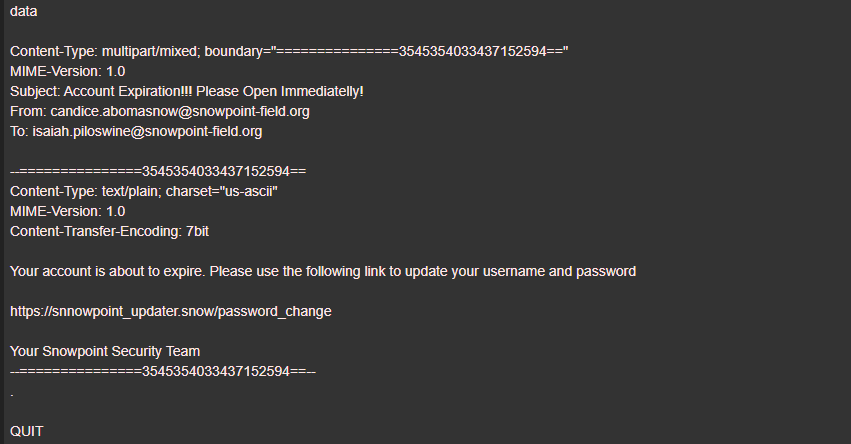

# The Phish Tank - 2
> Snowpoint’s security team spoke with an engineer who admitted to clicking a link included in an email with the subject line: Account Expiration!!! Please Open Immediatelly!. Luckily, the computer they clicked the link from did not have access to the Internet, so they were unable to reach the URL and nothing else happened. However, the security team would still like to know what the URL from this link was so they can add it to their blacklist and keep an eye on any attempted connections.

> What is the URL included in the email with subject line Account Expiration!!! Please Open Immediatelly!?

> Flag format: full URL. Example: https://icsjwgctf.com/scoreboard

## About the Challenge
We need to find the URL included in the email with subject line `Account Expiration!!! Please Open Immediatelly!?`

## How to Solve?
Find the email with subject line `Account Expiration!!! Please Open Immediatelly!?` in arkime dashboard and check the content of the email to obtain the malicous URL



```
https://snnowpoint_updater.snow/password_change
```