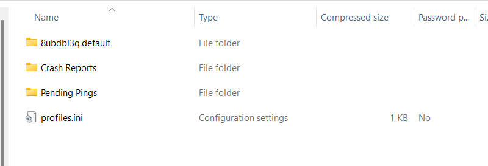
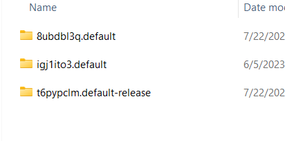
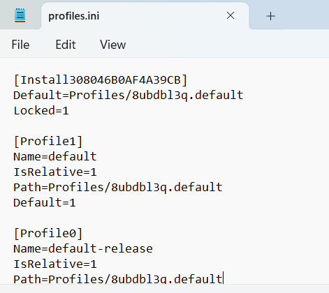
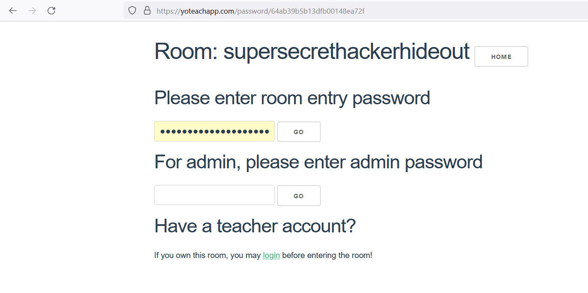
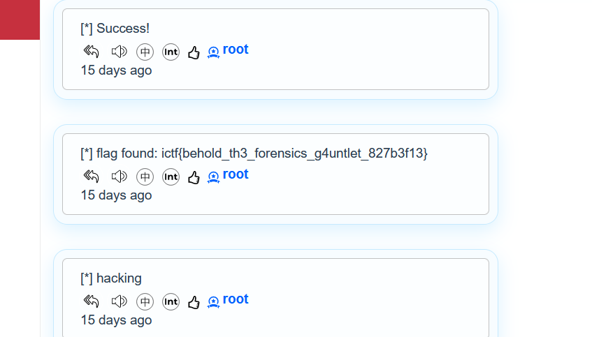

# web
> We recovered this file from the disk of a potential threat actor. Can you find out what they were up to?

## About the Challenge
We got a zip file (You can download the file [here](web.zip)) and it contains a mozilla firefox data



## How to Solve?
We need to import the data first in our mozilla, but how? First, access `C:\Users\test\AppData\Roaming\Mozilla\Firefox\Profiles` if you are using 



And then copy `8ubdbl3q.default` into the `Profiles` folder, and then you need to adjust the profile name on `profile.ini` file, the file location is in `C:\Users\test\AppData\Roaming\Mozilla\Firefox\`



And then, open Mozilla and check the history browser by pressing `Ctrl + H`


Hmm what is `PALMS Backchannel Chat`? Lets open the website



The room name was very suspicious and there was an autofill password. Login into the room using the password to obtain the flag



```
ictf{behold_th3_forensics_g4untlet_827b3f13}
```