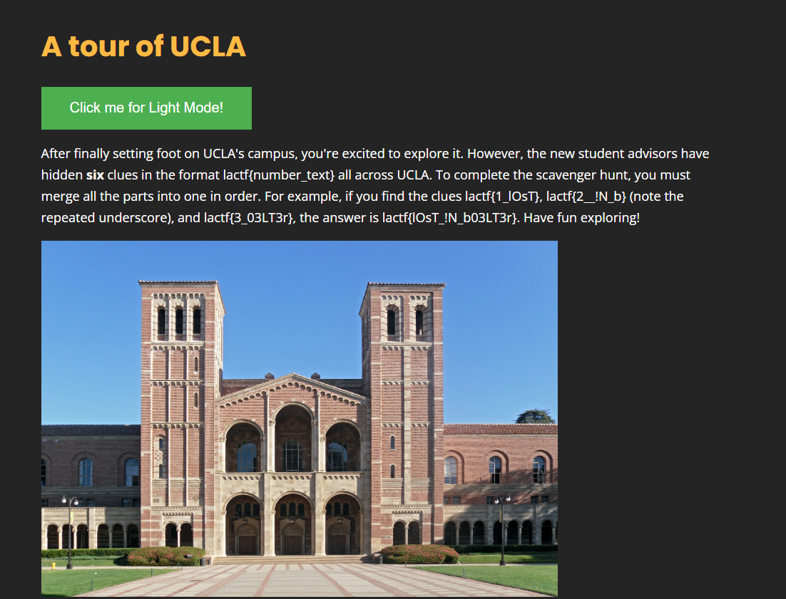
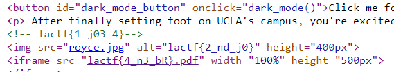
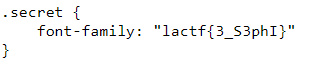
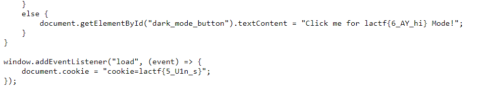

# college-tour
> Welcome to UCLA! To explore the #1 public college, we have prepared a scavenger hunt for you to walk all around the beautiful campus.

## About the Challenge
We were given a website and we need to find 6 parts of the flag. Here is the preview of the website



## How to Solve?
We need to check the source code first and I found 3 flag parts in the homepage
```
lactf{1_j03_4}
lactf{2_nd_j0}
lactf{4_n3_bR}
```



And then there is css and js file. In the css file I found 1 flag parts
```
lactf{3_S3phI}
```



And in the js file, I found 2 flag parts
```
lactf{5_U1n_s}
lactf{6_AY_hi}
```



After that we need to combine each part to know the final flag

```
lactf{j03_4nd_j0S3phIn3_bRU1n_sAY_hi}
```