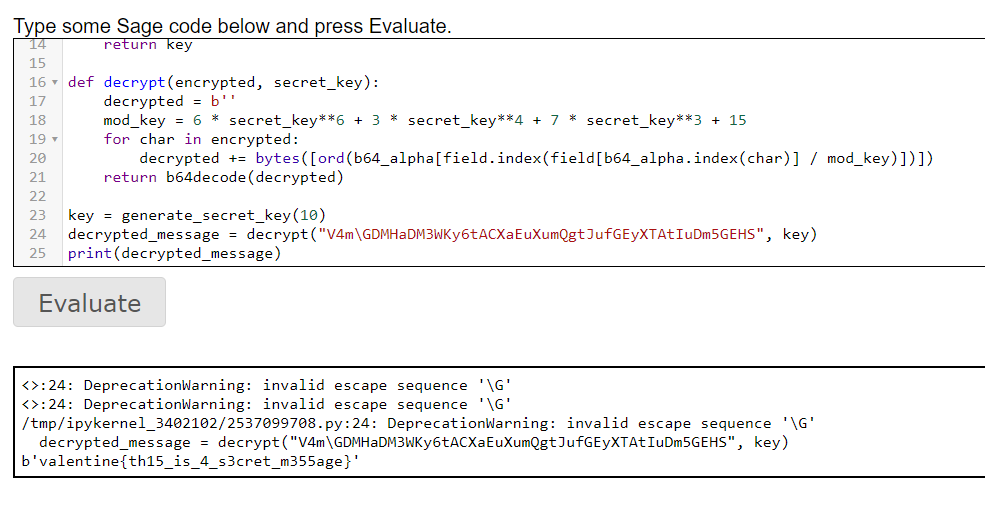

# Feb. 6 - Passing Notes
> Passing secret notes? That practically screams Valentine's Day to me! So, I've devised a super-secure way to encrypt a message so you can send it to that special someone! I used my program to encrypt a Valentine just for you! The only thing is... I don't remember the key. Ah, whatever! Here you go: `V4m\GDMHaDM3WKy6tACXaEuXumQgtJufGEyXTAtIuDm5GEHS`

> The `valentine{...}` wrapper is included in the encrypted text.

## About the Challenge
We were given a Python code, and the code will look like this
```python
from base64 import b64encode
from random import choice
from sage.all import GF

b64_alpha = "abcdefghijklmnopqrstuvwxyzABCDEFGHIJKLMNOPQRSTUVWXYZ0123456789\\="

field = list(GF(2**6))

def generate_secret_key(n):
  key = 1
  for _ in range(n):
    key *= choice(field)
    key += choice(field)
  return key

def encrypt(message, secret_key):
  message = b64encode(message)
  encrypted = ""
  mod_key = 6 * secret_key**6 + 3 * secret_key**4 + 7 * secret_key**3 + 15
  for char in message:
    encrypted += b64_alpha[field.index(field[b64_alpha.index(chr(char))] * mod_key)]
  return encrypted

key = generate_secret_key(10)
print(encrypt(b'[redacted]', key))
```

A list of elements from a finite field of size `2^6` is created using the GF function from the `sage.all` module. And then there is a function called `generate_secret_key(n)` is defined. This function generates a secret key by multiplying and adding random elements from the finite field n times. The final secret key is returned. There is a function called `encrypt(message, secret_key)`. This function takes a message and a secret key as input and returns an encrypted version of the message. The message is first encoded using the base64 module's b64encode function. Then, each character in the encoded message is encrypted by multiplying the corresponding element of the finite field with a modified key and mapping the result to a character in the base64 alphabet. The modified key is calculated by a polynomial `6 * secret_key^6 + 3 * secret_key^4 + 7 * secret_key^3 + 15`. A secret key is generated using generate_secret_key with a parameter of 10, and the message [redacted] is encrypted using encrypt with the generated secret key. The encrypted message is printed to the console.

## How to Solve?
To solve this chall, I created another function to decrypt the encrypted text
```python
def decrypt(encrypted, secret_key):
    decrypted = b''
    mod_key = 6 * secret_key**6 + 3 * secret_key**4 + 7 * secret_key**3 + 15
    for char in encrypted:
        decrypted += bytes([ord(b64_alpha[field.index(field[b64_alpha.index(char)] / mod_key)])])
    return b64decode(decrypted)
```

A mod_key variable is calculated using the secret_key argument. The value of `mod_key` is determined by the formula `6 * secret_key^6 + 3 * secret_key^4 + 7 * secret_key^3 + 15`. This formula is used to derive a modulus value that is used later in the decryption process. The function then iterates over each character in the encrypted string. For each character, the code first looks up the index of the character in the `b64_alpha` list using the `b64_alpha.index(char)` method. `b64_alpha` is presumably a list that contains the characters of the base64 encoding alphabet. The code then uses the result of the previous step to index the field list, which is presumably another list of some kind. The value at the resulting index is divided by `mod_key`. The result of the division is used to index the `b64_alpha` list again to get the decrypted character. The decrypted character is then appended to the decrypted variable using the `+=` operator. After all characters have been processed, the decrypted byte string is base64 decoded using the `b64decode` function from the base64 module.

And if we run the program several times, we will get the flag



```
valentine{th15_is_4_s3cret_m355age}
```