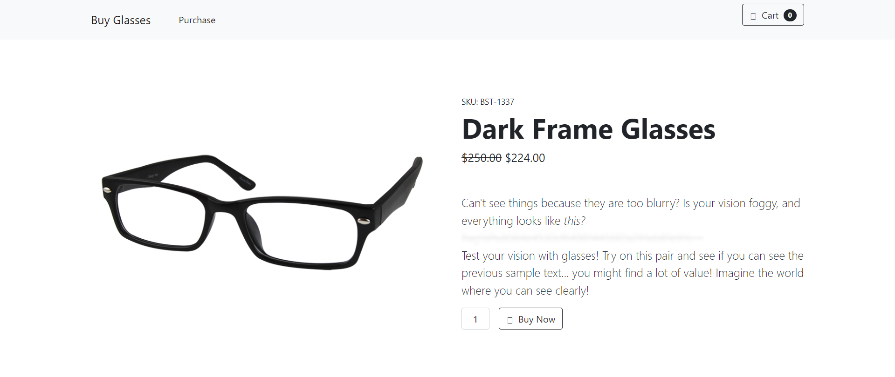
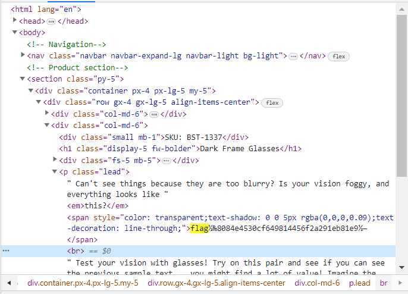

# Glasses
> Everything is blurry, I think I need glasses!

## About the Challenge
We've got a simple website like this and inside the website there is an obfuscated javascript



## How to Solve?
To solve this chall, we need to open `inspect element` and then find the flag below `<em>this?</em>` tag HTML



```
flag{8084e4530cf649814456f2a291eb81e9}
```