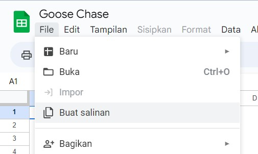
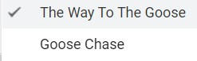
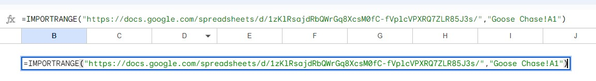
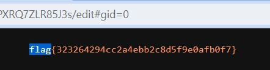

# Goose Chase

> I am truly sorry. I really do apologize... I hope you can bear with me as I set you all loose together, on a communal collaboriative wild goose chase.

[Google sheets link](https://docs.google.com/spreadsheets/d/17qy0Yw1_8rLOhrG5MWT8rWzpMi3_1vr3A_khcv3j6Cc/)

## How to Solve

First visit the google sheets link

After that make copy from the sheets



Access the hidden sheet



You will see the link to the other sheets



View-source the sheets, and you get the flag



```
flag{323264294cc2a4ebb2c8d5f9e0afb0f7}  
```