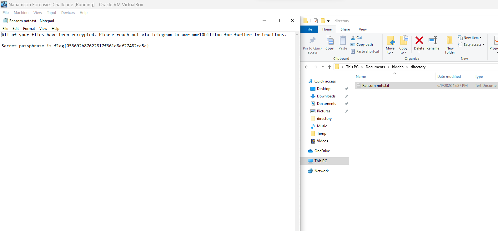

# IR #1
> Can you find the hidden file on this VM?

## About the Challenge
We've got a VM, and we need to find the hidden file

## How to Solve?
To solve this chall, we need to enable `Show hidden files, folders, and drive` option and then read the flag in the `C:\Users\IEUser\Documents\hidden\directory`, inside a notepad file called `Ransom note.txt`



```
flag{053692b87622817f361d8ef27482cc5c}
```