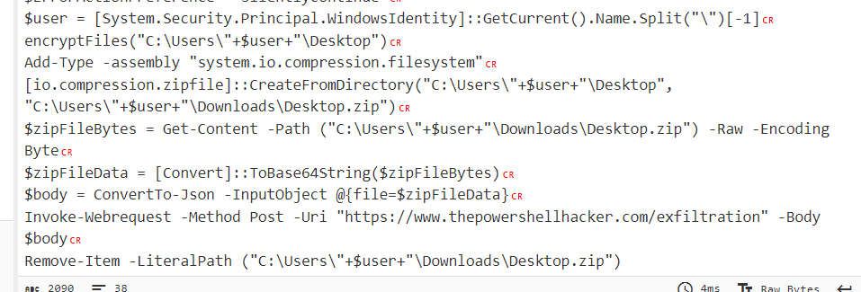

# IR #4
> Where is the data being exfiltrated? Please give the MD5 hash of the URL with the usual wrapper of flag{}.

## About the Challenge
We need to find the threat actor server, and then hash it using MD5

## How to Solve?
You can see the threat actor server in the powershell script that we have obfuscate before (Check [IR #3](/NahamCon%20CTF%202023/IR%20%233/))



And then hash it using this command

```shell
echo -n "https://www.thepowershellhacker.com/exfiltration" | md5sum
```

And then wrap the MD5 hash with `flag{}`

```
flag{32c53185c3448169bae4dc894688d564}
```