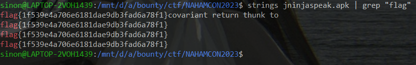

# JNInjaspeak
> We are all very familiar with Leetspeak, can you crack the code on how JNInjaspeak works?

## About the Challenge

Given .apk files, and we must analyzed it to find flag

[file.apk](files/jninjaspeak.apk)

## How to Solve

To solve this, all you need is `strings` command

The following command is like this `strings file.apk | grep "flag"`



```
flag{1f539e4a706e6181dae9db3fad6a78f1}
```