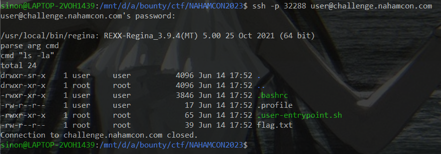
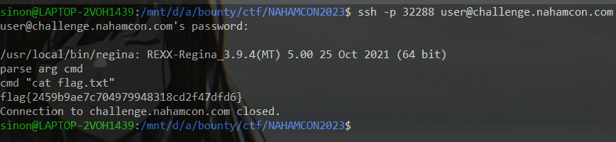

# Regina

> I have a tyrannosaurus rex plushie and I named it Regina! Here, you can talk to it :)

## How to Solve

First you make a parse command to execute in the server, after that you `CTRL + D`
to send signal the end of input (EOF)



And then reproduce same process and read the flag



```
flag{2459b9ae7c704979948318cd2f47dfd6}
```