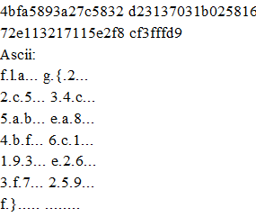

# tiny little fibers
> Oh wow, it's another of everyone's favorite. But we like to try and turn the ordinary into extraordinary!

## About the Challenge

We given the image file, and we need analyze to find flag

[images](images/tiny-little-fibers)

## How to Solve

To solve this, all you need is `stegsolve`

You can download here [stegsolve](https://github.com/zardus/ctf-tools/blob/master/stegsolve/install)

But before you open it to stegsolve, make sure already add the `.jpeg` extension

After that `Analyse` > `File Format`, just slowly scroll down and you got flag



```
flag{22c534c5abea84bf6c1193e263f7259f}
```