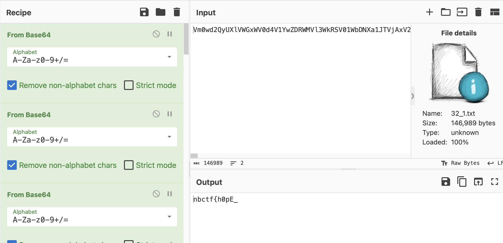
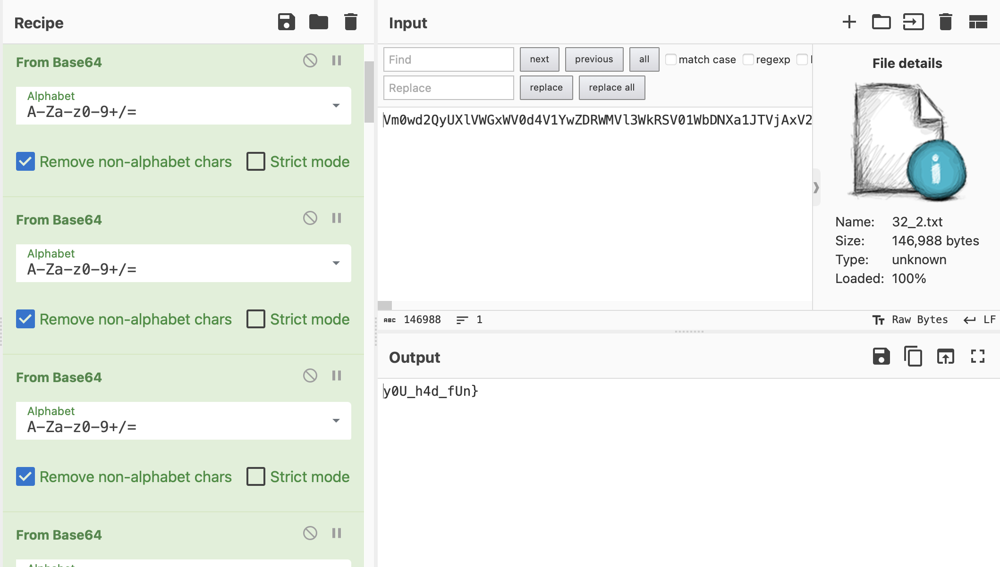

# 32+32=64
> 64 is too much, but 32 isn't. 32+32=64?

## About the Challenge
We were given 2 files and each file contains base64 encoded text (You can download the file [here](32_1.txt) and [here](32_2.txt))

## How to Solve?
Open the file in CyberChef and then decode the encoded text using `Base64` encoding 32 times





```
nbctf{h0pE_y0U_h4d_fUn}
```