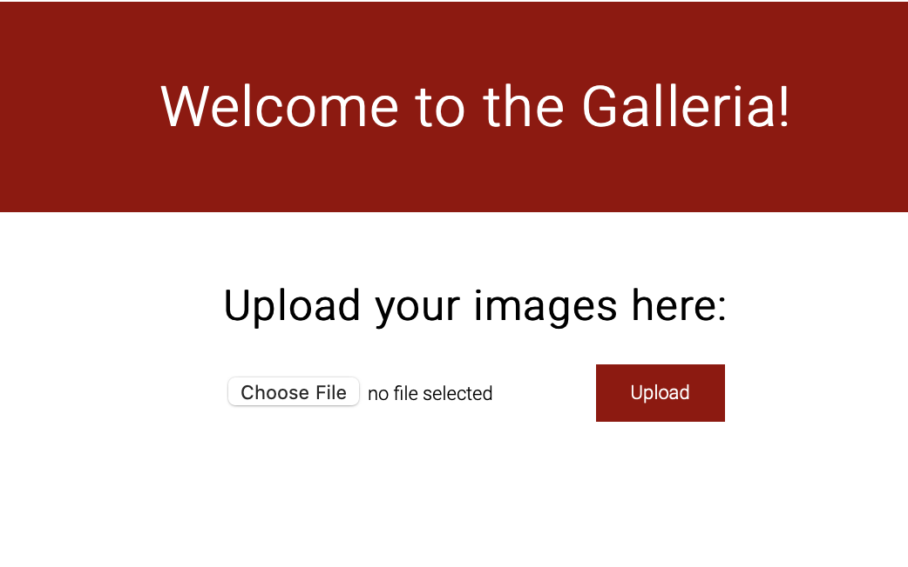
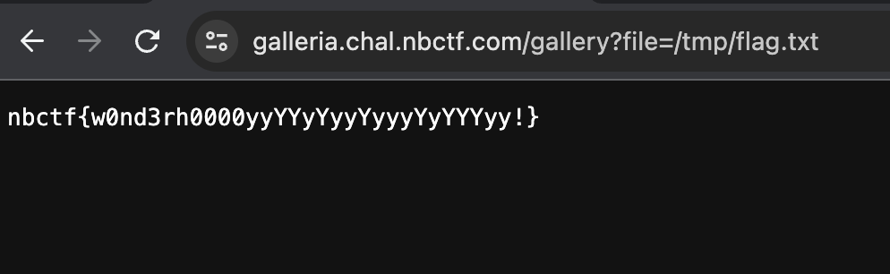

# Galleria
> Put up some fun images for everyone in this amazing image gallery!

## About the Challenge
We were given a web and a source code, the web has many functionalities such as:
* We can upload an image
* We can read arbitrary file

Here is the preview of the website



## How to Solve?
If we check the `Dockerfile` file, the flag was located in `/tmp/flag.txt` and because we can read any file using `/gallery` endpoint

```python
@app.route('/gallery')
def gallery():
    if request.args.get('file'):
        filename = os.path.join('uploads', request.args.get('file'))
        if not check_file_path(filename):
            return redirect(url_for('gallery'))

        return send_file(filename)

    image_files = [f for f in os.listdir(
        app.config['UPLOAD_FOLDER'])]
    return render_template('gallery.html', images=image_files)
```

We can read the flag using this [payload](https://galleria.chal.nbctf.com/gallery?file=/tmp/flag.txt)



```
nbctf{w0nd3rh0000yyYYyYyyYyyyYyYYYyy!}
```