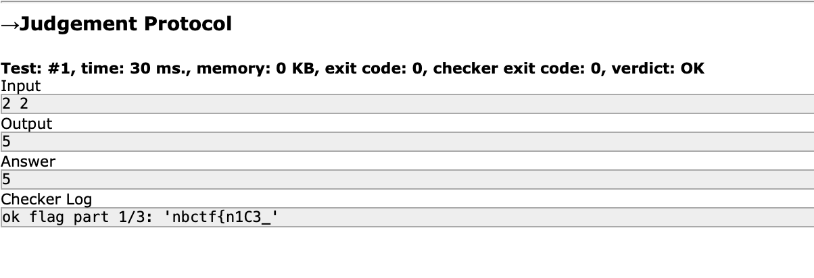
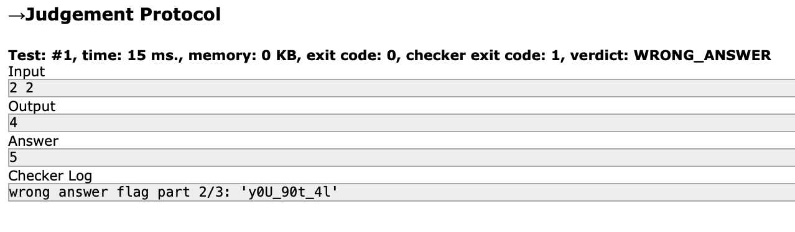
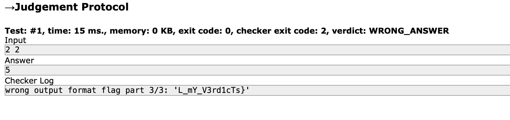

# not accepted
> I can't seem to pass this problem... can you help me? https://codeforces.com/contestInvitation/9cf6e56adf19ecb8e5dd7af8a9c5bf5610c8e46e

## About the Challenge
We were given a "programming" chall, but in this case we need to only input wrong and correct answer to get all the flag

## How to Solve?!







```
nbctf{n1C3_y0U_90t_4lL_mY_V3rd1cTs}
```