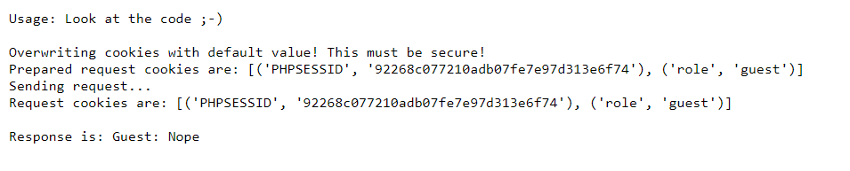
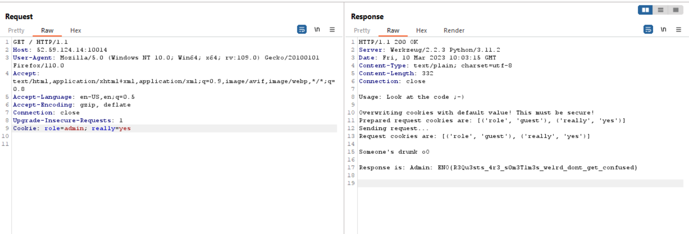

# reguest
> HTTP requests and libraries are hard. Sometimes they do not behave as expected, which might lead to vulnerabilities.

## About the Challenge
We were given a website and the source code (You can get the source code [here](chall.zip)). The website is pretty plain, here is the preview



## How to Solve?
If we check on the source code (Especially `backend.py` file), to get the flag there are 2 conditions that must been met

```python
@app.route('/whoami')
def whoami():
	role = request.cookies.get('role','guest')
	really = request.cookies.get('really', 'no')
	if role == 'admin':
		if really == 'yes':
			resp = 'Admin: ' + os.environ['FLAG']
		else:
			resp = 'Guest: Nope'
	else:
		resp = 'Guest: Nope'
	return Response(resp, mimetype='text/plain')
```

First, a cookie named `role` must be set to `admin`, and second, a cookie named `really` must be set to `yes`. After setting the cookies in the HTTP request header, you will receive the flag.



```
ENO{R3Qu3sts_4r3_s0m3T1m3s_we1rd_dont_get_confused}
```