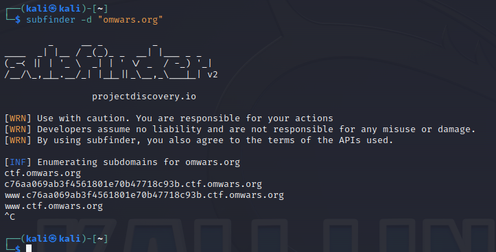
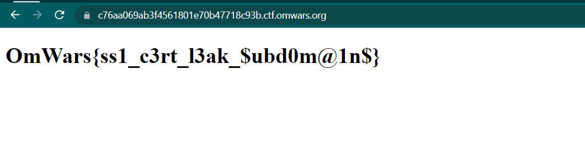

# galactic subdomains
> Find the secret dns record for the domain omwars.org

## About the Challenge
We need to find information about omwars.org dns record

## How to Solve?
To solve this, im using subdomain enumeration tool. In this case im using `subfinder`



As you can see there is a weird subdomain. If we access the subdomain we will get the flag



```
OmWars{ss1_c3rt_l3ak_$ubd0m@1n$}
```