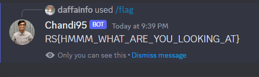

# Chandi Bot 2
> Looks like the bot has some functionality.

## About the Challenge
We need to discover the bot functionality to obtain the flag

## How to Solve?
There is a channel called `#chandi-bot` in their discord server, and you can enter the `/` character to see some commands that the bot can run.


Input `/flag` command to obtain the flag



```
RS{HMMM_WHAT_ARE_YOU_LOOKING_AT}
```