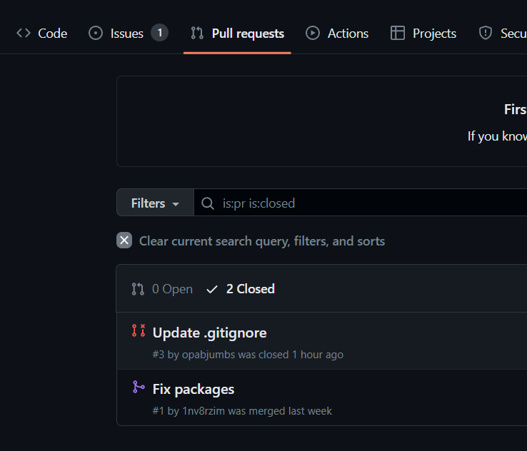
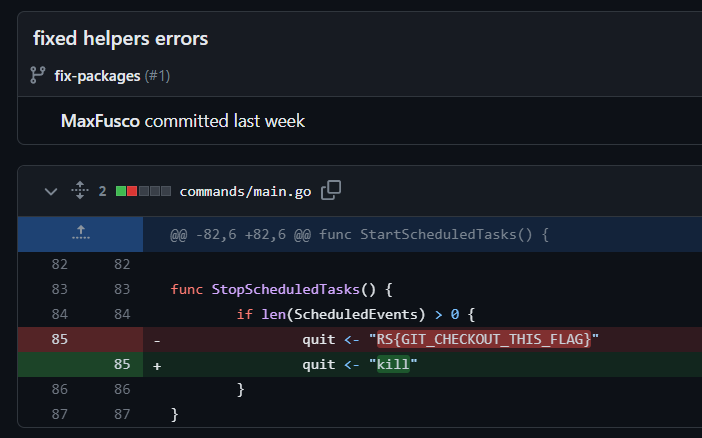

# Chandi Bot 6
> We finally found the source code. Can you dig through find the secret?

> https://github.com/1nv8rzim/Chandi-Bot

## About the Challenge
We need to find the flag inside `Chandi-Bot` repository

## How to Solve?
Open the repository and then go to `Pull requests` menu



Choose the first [pull request](https://github.com/1nv8rzim/Chandi-Bot/pull/1) and then choose `fixed helpers errors` commit to obtain the flag



```
RS{GIT_CHECKOUT_THIS_FLAG}
```