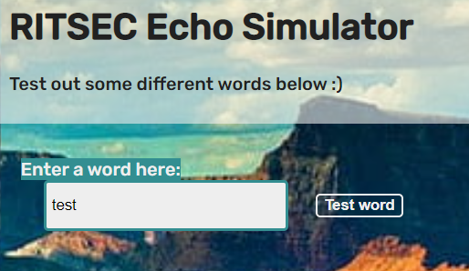

# Echose
> Do you hear that?

> https://echoes-web.challenges.ctf.ritsec.club/

## About the Challenge
We were given a website that has a functionality print our input



## How to Solve?
This website was vulnerable to Command Injection. Try to input `; ls` to run `ls` command


As we can see there is a file called `flag.txt` try read it using `; cat flag.txt` command


```
RS{R3S0UND1NG_SUCS3SS!}
```