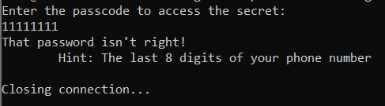
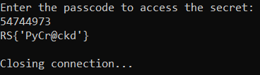

# Guess the Password?
> We found a VIP's box, but when we try to guess his short password, we get rate limited! We managed to get the source code and it looks like the server implements its security in a way that isn't secure! Can you reverse the python code and get the flag?

## About the Challenge
We were given a server to connect and there are 3 files:
* encoding.py (You can download the file [here](encoding.py))
* server.py (You can download the file [here](server.py))
* supersecret.json (You can download the file [here](supersecret.json))

So, we need to the passcode to obtain the flag



If we check in the `server.py` there is a function called `chatter()` and here is the code

```python
client_socket.send( "Enter the passcode to access the secret: \n".encode() )
user_input = client_socket.recv(1024).decode() [:8]

if len(user_input) == 8 and self.encoder.check_input(user_input):
    secret = self.encoder.flag_from_pwd(user_input)
    response = f"RS{ {secret} }\n"

else:
    response = "That password isn't right!\n\tHint: The last 8 digits of your phone number\n"
```

We need to input a passcode that have 8 characters and then if we check `check_input()` and `hash()` function in `encoding.py` file

```python
def hash(self, user_input):
    salt = "RITSEC_Salt"
    return hashlib.sha256(salt.encode() + user_input.encode()).hexdigest()

def check_input(self, user_input):
    hashed_user_input = self.hash(user_input)
    # print("{0} vs {1}".format(hashed_user_input, self.hashed_key))
    return hashed_user_input == self.hashed_key
```

The SHA256 hash of the salt plus our input must match `657fa7558ae9011e8b9d3f56d5c083273557c3139f27d7b62cac458eb1a1a19d` (You can check this in `supersecret.json` file).

## How to Solve?
So, I've created a python script like this

```python
import hashlib
import itertools

salt = "RITSEC_Salt"
target_hash = "657fa7558ae9011e8b9d3f56d5c083273557c3139f27d7b62cac458eb1a1a19d"
alphabet = '1234567890'

for combination in itertools.product(alphabet, repeat=8):
    test = bytes(''.join(combination), 'utf-8')
    sha = hashlib.sha256(salt.encode() + test).hexdigest()

    if sha == target_hash:
        print(f"Found: {test}")
        break
```

The code will bruteforce the passcode and hash each combination with the salt and then check if the `sha` variables match with the target_hash

```
Found: b'54744973'
```

And then enter the passcode in the challenge server to obtain the flag



```
RS{'PyCr@ckd'}
```