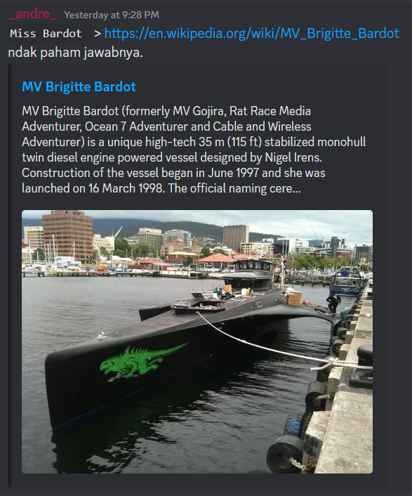

# Miss Bardot
> To some she was an icon, to others she was a sheperd, I need you to find the one that's already gone.

> Flag1: Who made her and what's her flag?
> RUSH{ALLCAPSBUILDERNAMEFLAG}

## About the Challenge
We need to know what `Miss Bardot` is and then find the builder name and the flag

## How to Solve?
I got the solution because one of the team member give me a link about `MV Brigitte Bardot` on a group chat



And after searching on wikipedia, I know the builder name is `Vosper Thornycroft` and the flag is `Australia`, but when I submit the flag, the flag was wrong. So i opened the ticket and I told them what i have found before they said the builder name is correct but the flag is wrong.

I tried to doing a little search again about the flag, and I found some website said `MV Brigitte Bardot` flag is `Dominica`


```
RUSH{VOSPERTHORNYCROFTDOMINICA}
```