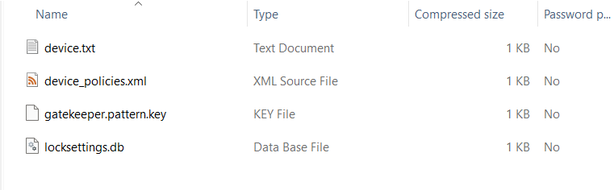
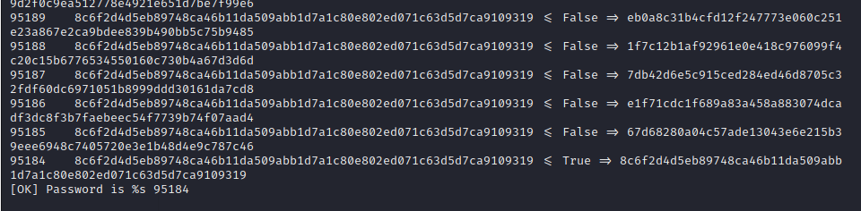
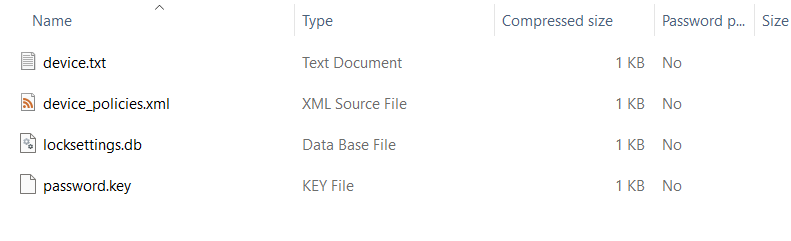
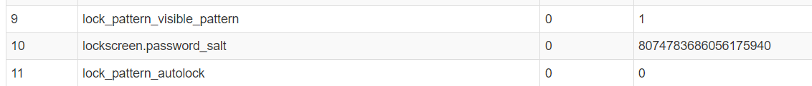

# Android Zoo
> Who knew pigeons could use Android phones?

> This sus pigeon stored the flag on 2 phones, and the flag format is SEE{<password>:<gesture_pattern>}.

> For example, if the password is password and the gesture pattern is 1337, the flag is SEE{password:1337}

> Hint: Don't worry, the password is in rockyou!

> Side note: why aren't there any pigeons in zoos?

## About the Challenge
We were given a `zip` file that contains 2 folders called `first_devices` and `second_devices`. And in these folders there is information related to the device such as the device name, then there is a kind of file containing passwords and so on. And our goal is to get the password of the two devices

## How to Solve?

Lets see the `first_device` folder first



If you open `device_policies.xml`, you will see the length of the password is 5

```xml
<?xml version='1.0' encoding='utf-8' standalone='yes' ?>
<policies setup-complete="true">
<active-password quality="65536" length="5" uppercase="0" lowercase="0" letters="0" numeric="0" symbols="0" nonletter="0" />
</policies>
```

And then I tried to find an information about cracking `gatekeeper.pattern.key` and I found this [website](http://webcache.googleusercontent.com/search?q=cache%3Ahttp%3A%2F%2Fkoifishly.com%2F2021%2F06%2F25%2Fandroid%2Fsystem%2Fandroid-suo-ping-mi-ma-de-fen-xi%2F&oq=cache%3Ahttp%3A%2F%2Fkoifishly.com%2F2021%2F06%2F25%2Fandroid%2Fsystem%2Fandroid-suo-ping-mi-ma-de-fen-xi%2F&aqs=chrome..69i57j69i58.3125j0j4&sourceid=chrome&ie=UTF-8)

As you can see, because the length of the password is 5, I created a file called `num.txt` that contains all combination of the password. For example:

```
00000
00001
00002
...
```

And then I tried using Python code on the website to find the password of the first device.

```python
# -*- coding=utf-8 -*-
import struct
import binascii
import scrypt
N = 16384;
r = 8;
p = 1; 

current_index = 1

f=open('gatekeeper.pattern.key', 'rb')
blob = f.read() 
s = struct.Struct('<'+'17s 8s 32s')
(meta, salt, signature) = s.unpack_from(blob)

f1=open('num.txt','r')
lines=f1.readlines()
lines.reverse() 
for data in lines:
    password=data.strip()  
    to_hash = meta
    to_hash += password.encode(encoding='utf-8')
    hash = scrypt.hash(to_hash, salt, N, r, p)
    print ('{}    {} <= {} => {}'.format(password, signature.hex(),(hash[0:32] == signature), hash[0:32].hex()))
    current_index = current_index+1    
    if hash[0:32] == signature:
        print ("[OK] Password is %s", password )
        exit()
```

Wait until the program stops, and as you can see the password is `95184`



After I got the first password, now lets check the second folder



If you open `device_policies.xml`, you will see the length of the password is 11 (3 uppercase, 7 lowercase, and 1 numeric)

```xml
<?xml version='1.0' encoding='utf-8' standalone='yes' ?>
<policies setup-complete="true">
<active-password quality="327680" length="11" uppercase="3" lowercase="7" letters="10" numeric="1" symbols="0" nonletter="1" />
</policies>
```

And then I tried to find an information about cracking `password.key` and I found this [website](https://arishitz.net/writeup-secr3tmgr-forensic-insomnihack-2017/)

We need to parse `locksettings.db` file first to get the salt



And then if you open `password.key` you will see this string

```
6DFE4D0C832761398B38D7CFAD64D78760DEBAD266EB31BD62AFE3E486004CE6ECEC885C
```

When I read the blog find that the hexadecimal string of 72 bytes corresponds to the concatenation of the sha1(password + salt) and the md5(password + salt). And in the end, we got this information

```
6DFE4D0C832761398B38D7CFAD64D78760DEBAD2 = SHA1
66EB31BD62AFE3E486004CE6ECEC885C = MD5
8074783686056175940 = salt
```

Convert the salt first

```shell
printf "%x\n" 8074783686056175940
```

Store the hash using below format into a file called `hash.txt`

```
66EB31BD62AFE3E486004CE6ECEC885C$700f64fafd7f6944
```

And then run `john` using this command

```
john -form=dynamic='md5($p.$s)' --wordlist=/usr/share/wordlists/rockyou.txt hash.txt
```

The password is `PIGeon4ever`

```
SEE{PIGeon4ever:95184}
```