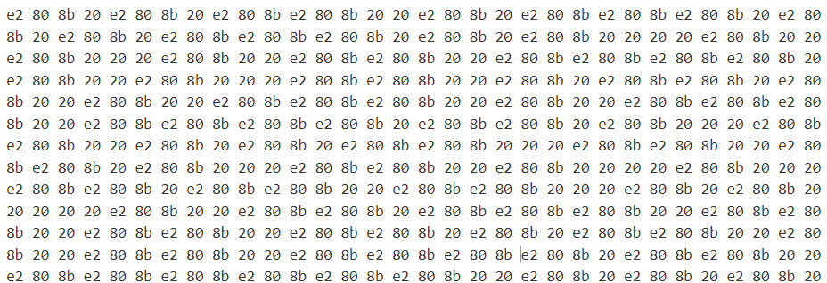
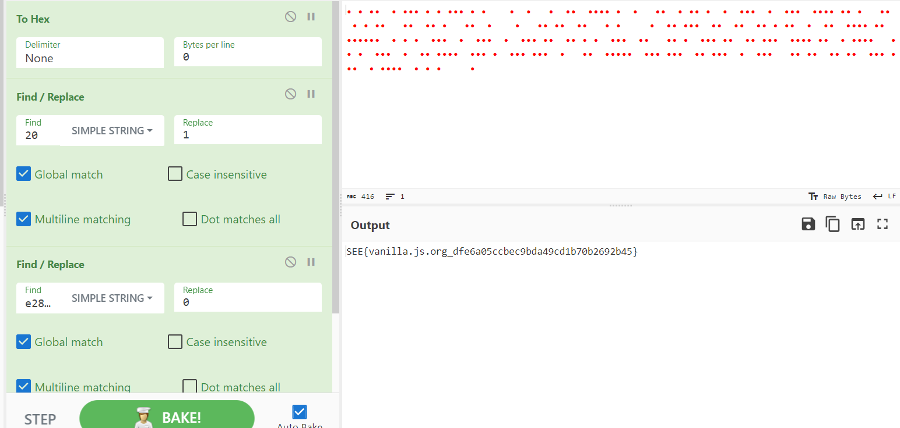

# 🎓 NoCode
> NoCode is the best way to write secure and reliable applications. Write nothing; deploy nowhere.
> Getting Started
> Start by not writing any code.
```
​​​
```
> This is just an example application, but imagine it doing anything you want. Adding new features is easy too:
```
​ ​ ​​  ​ ​​​ ​ ​ ​​​ ​ ​    ​  ​   ​  ​​  ​​​​ ​  ​   ​​  ​ ​​ ​  ​  ​​​  ​  ​​​  ​​​​ ​​ ​   ​​  ​ ​ ​​   ​​  ​​ ​   ​​  ​    ​   ​​ ​​  ​​   ​ ​     ​  ​​ ​​​  ​​  ​​  ​​ ​ ​​  ​  ​​  ​​​​ ​​  ​​​​​​  ​ ​ ​  ​​​  ​  ​​​  ​  ​​​ ​​  ​​ ​ ​  ​​​  ​​   ​​ ​  ​​​ ​​  ​​ ​​​  ​​​​ ​​  ​ ​​​​   ​​ ​  ​​​  ​  ​​ ​​​​  ​​​ ​  ​​​ ​​​  ​   ​​  ​​​​​  ​​​ ​​​  ​​ ​​​  ​  ​​​   ​​ ​​  ​​ ​​  ​​​ ​​​  ​ ​​​​  ​ ​ ​     ​ 
```

## About the Challenge
We were given a `blank` string, and we need to find the flag there

## How to Solve?
If you convert the `blank` string into hexadecimal, you will see something like this



Change `20` to `1` and `e2 80 8b` to `0` (Using find / replace feature if you are using cyberchef). And then convert it again using binary. Here is the link of cyberchef

```
https://gchq.github.io/CyberChef/#recipe=To_Hex('None',0)Find_/_Replace(%7B'option':'Simple%20string','string':'20'%7D,'1',true,false,true,false)Find_/_Replace(%7B'option':'Simple%20string','string':'e2808b'%7D,'0',true,false,true,false)From_Binary('None',8)&input=4oCLIOKAiyDigIvigIsgIOKAiyDigIvigIvigIsg4oCLIOKAiyDigIvigIvigIsg4oCLIOKAiyAgICDigIsgIOKAiyAgIOKAiyAg4oCL4oCLICDigIvigIvigIvigIsg4oCLICDigIsgICDigIvigIsgIOKAiyDigIvigIsg4oCLICDigIsgIOKAi%2BKAi%2BKAiyAg4oCLICDigIvigIvigIsgIOKAi%2BKAi%2BKAi%2BKAiyDigIvigIsg4oCLICAg4oCL4oCLICDigIsg4oCLIOKAi%2BKAiyAgIOKAi%2BKAiyAg4oCL4oCLIOKAiyAgIOKAi%2BKAiyAg4oCLICAgIOKAiyAgIOKAi%2BKAiyDigIvigIsgIOKAi%2BKAiyAgIOKAiyDigIsgICAgIOKAiyAg4oCL4oCLIOKAi%2BKAi%2BKAiyAg4oCL4oCLICDigIvigIsgIOKAi%2BKAiyDigIsg4oCL4oCLICDigIsgIOKAi%2BKAiyAg4oCL4oCL4oCL4oCLIOKAi%2BKAiyAg4oCL4oCL4oCL4oCL4oCL4oCLICDigIsg4oCLIOKAiyAg4oCL4oCL4oCLICDigIsgIOKAi%2BKAi%2BKAiyAg4oCLICDigIvigIvigIsg4oCL4oCLICDigIvigIsg4oCLIOKAiyAg4oCL4oCL4oCLICDigIvigIsgICDigIvigIsg4oCLICDigIvigIvigIsg4oCL4oCLICDigIvigIsg4oCL4oCL4oCLICDigIvigIvigIvigIsg4oCL4oCLICDigIsg4oCL4oCL4oCL4oCLICAg4oCL4oCLIOKAiyAg4oCL4oCL4oCLICDigIsgIOKAi%2BKAiyDigIvigIvigIvigIsgIOKAi%2BKAi%2BKAiyDigIsgIOKAi%2BKAi%2BKAiyDigIvigIvigIsgIOKAiyAgIOKAi%2BKAiyAg4oCL4oCL4oCL4oCL4oCLICDigIvigIvigIsg4oCL4oCL4oCLICDigIvigIsg4oCL4oCL4oCLICDigIsgIOKAi%2BKAi%2BKAiyAgIOKAi%2BKAiyDigIvigIsgIOKAi%2BKAiyDigIvigIsgIOKAi%2BKAi%2BKAiyDigIvigIvigIsgIOKAiyDigIvigIvigIvigIsgIOKAiyDigIsg4oCLICAgICDigIsg
```



```
SEE{vanilla.js.org_dfe6a05ccbec9bda49cd1b70b2692b45}
```