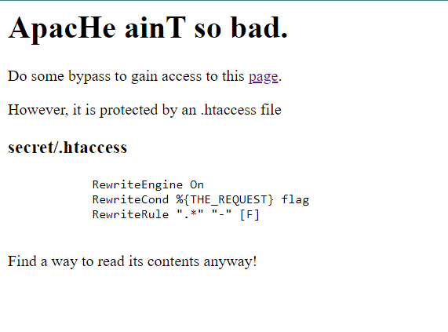
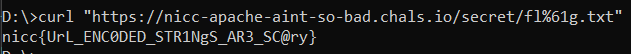

# Apache Ain't So Bad
> This webpage seems to block any attempts at viewing the flag file. It seems to be using an htaccess file to block our requests. Is there anyway you can find a way to bypass this?

> https://nicc-apache-aint-so-bad.chals.io

## About the Challenge
We need to access to https://nicc-apache-aint-so-bad.chals.io/secret/flag.txt endpoint. But there is a restriction on the `.htaccess` configuration. The configuration will block any request that contains the string `flag`



## How to Solve?
We need to change the character from ASCII to URL encoding. For example `flag.txt` to `fl%61g.txt`.

You can't directly access https://nicc-apache-aint-so-bad.chals.io/secret/fl%61g.txt endpoint using your browser because the browser will automatically decode the encoding. So you will need `curl` or you can just using `Repeater` tab on your burpsuite

```
curl "https://nicc-apache-aint-so-bad.chals.io/secret/fl%61g.txt"
```



```
nicc{UrL_ENC0DED_STR1NgS_AR3_SC@ry}
```