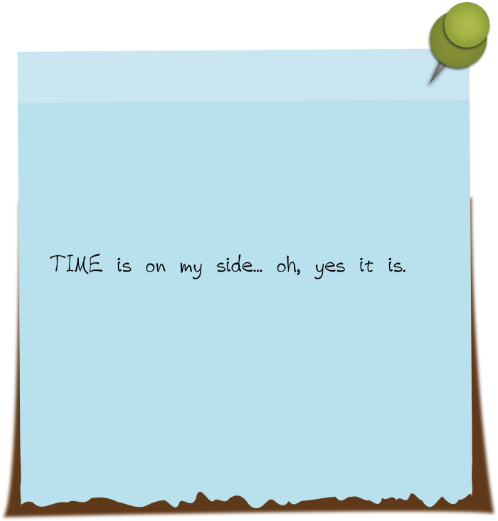
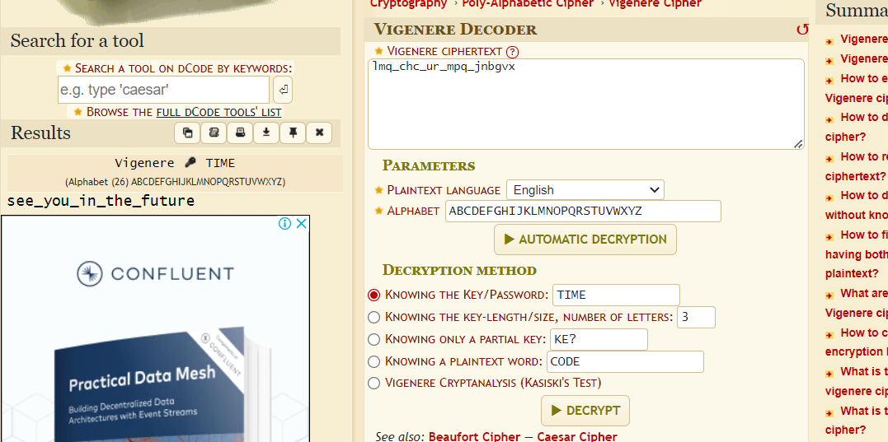

# Dear Tom
> Keys are hard to memorize, especially with tests coming up.

> I guess whoever has been breaking in around campus is struggling to keep things straight, too.

> We found a message left up on a terminal with a post it next to it.

> We think it might be a key to solving the message that was left up, but haven't cracked it just yet. Think you could?

> lmq_chc_ur_mpq_jnbgvx

## About the Challenge
We were given a picture file and an encoded msg



## How to Solve?
To decode the encoded msg use `Vigenere Cipher` to get the flag and then set the key to `TIME`



```
nicc{see_you_in_the_future}
```