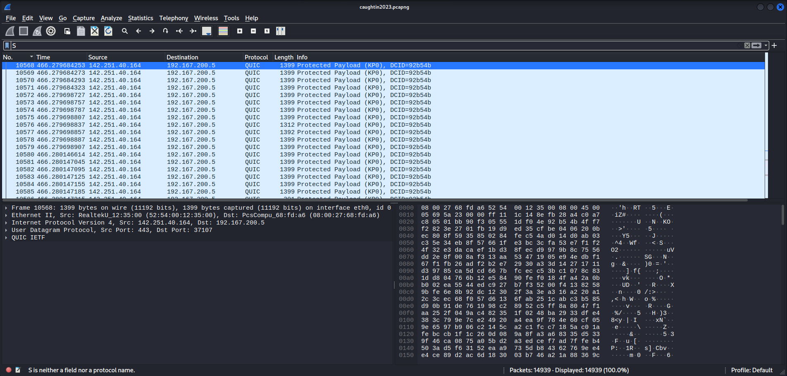
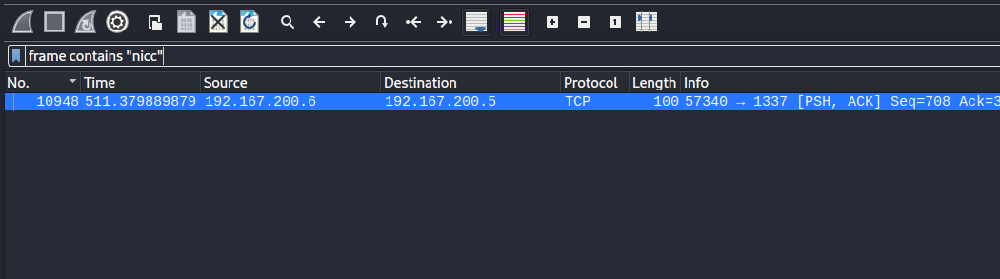
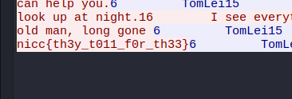

# No Expectation of Privacy
> We've been monitoring data coming and going from around campus. Might be worth looking into it to see if anything weird stands out.

> Could be that's how whoever is behind the weird stuff on campus is communicating? We're looking for something from someone named RB.

## About the Challenge
We were given a `pcapng` file (You can get the flag [here](caughtin2023.pcapng)), so we need Wireshark to open the file



## How to Solve?
First I tried to use `frame contains "nicc"` in the filter and there is 1 packet that contains string `nicc`.



Right click the packet and follow TCP stream to get the flag



```
nicc{th3y_t011_f0r_th33}
```