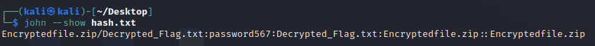

# Old Habits Die Hard
> We found this zip file but its encrypted so we can't read the contents. Do you think you could crack it?

## About the Challenge
We were given a zip file (Password protected) and the wordlist. So we need to brute the zip to get the flag

## How to Solve?
First, we need to crack the zip file using 2 tools (zip2john and john). Run this command to get the password of the zip file
```bash
zip2john Encryptedfile.zip > hash.txt
john -w=wordlist.txt hash.txt
john --show hash.txt
```



The password is `password567`. Now open the zip file using that password and you will get the flag

```
nicc{P@$$w0rd_l!$t$}
```