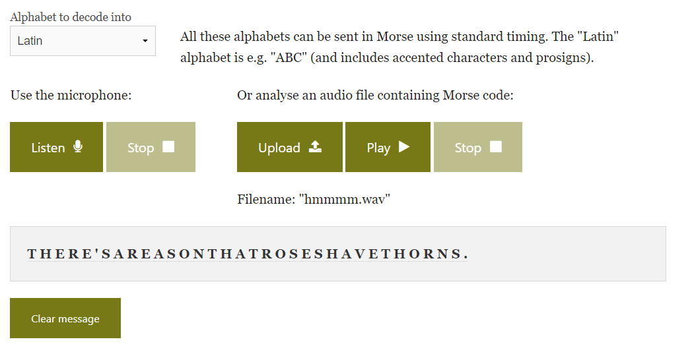

# What's camping without s'morse?
> Some of the NICC members were trying to get away camping after midterms, but all of their headphones immediately started blaring this sound when they tried to leave campus.

> Someone grabbed a recording, maybe we can piece it together?

> Format: nicc{words_separated_by_underscores}

## About the Challenge
We were given a `.wav` file (You can download the file [here](hmmmm.wav))

## How to Solve?
Just use morse code translator online to get the flag



```
nicc{there's_a_reason_that_roses_have_thorns.}
```