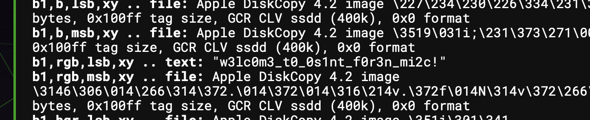

# stego WarmUp
> Welcome to the challenges of misc, forensic, and osint! Can you find the flag in this beautiful blank sheet? Good luck!

> Flag must be submitted in srdnlen{} format: wrap the found flag in srdnlen{}

## About the Challenge
We need to find the flag inside this blank photo (You can download the file [here](stegoWarmUp.png))

## How to Solve?
You can use `zsteg` or you can use AperiSolve website to obtain the flag



```
srdnlen{w3lc0m3_t0_0s1nt_f0r3n_mi2c!}
```