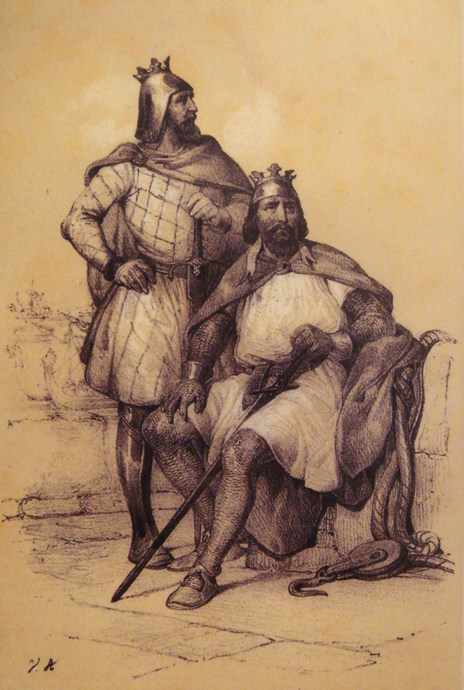
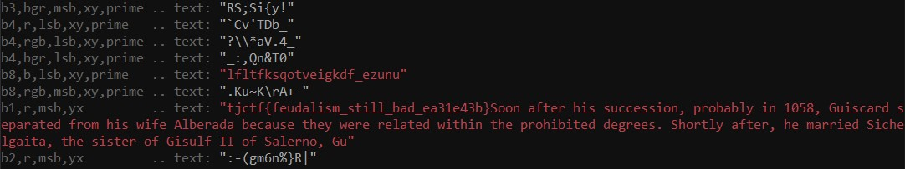

# neofeudalism
> One of my friends has gotten into neo-feudalism recently. He says that society should be more like a feudalist one, with unequal rights, legal protections, and wealth distribution.

## About the Challenge

We given a image and we must find flag from this image



## How to Solve

To solve this challenge, we use `zteg`

For the full command `zsteg -a image.png` which is mean -a is try all known method



We found flag on `b1,r,msb,yx` section

```
tjctf{feudalism_still_bad_ea31e43b}
```