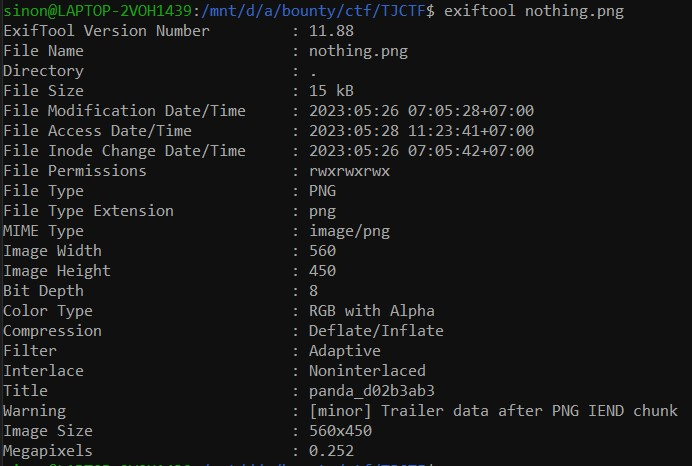
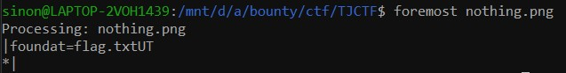
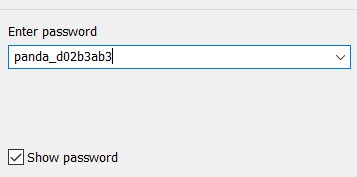
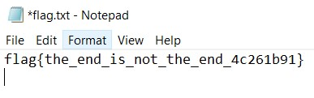

# nothing-to-see
> nothing to see here, just move along

## About the Challenge

We have given a image like this and we need find the flag from the given image


## How to Solve

Fist you need do `exiftool` on this image, and you'll find interesting information



You'll see the Title is `panda_d02b3ab3`, it will be use after this

After that you can perform `foremost` to see if there any extracted file



You'll find the zip file which is locked, the password is use from what we've got from exiftool



And we got flag



```
tjctf{the_end_is_not_the_end_4c261b91}
```