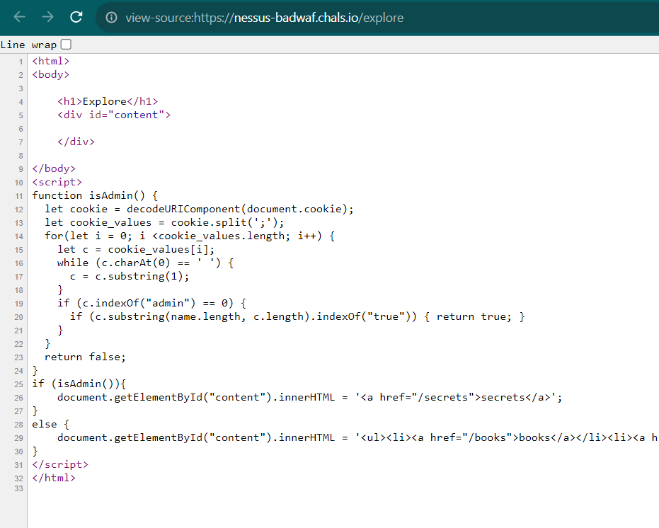

# Bad Waf No Donut
> I made a simple little backdoor into my network to test some things. Let me know if you find any problems with it.

## About the Challenge
We were given a very simple website without any source code, here is the preview of the website


## How to Solve?
At first i went to `/explore` endpoint and in the source there are another endpoint called `/secrets`



In the `/secrets` endpoint there is a HTML comment tells us to use `POST` method with `secret_name` as a parameter


When I tried to send a `POST` request with `secret_name` as parameter, the reseponse was a little bit weird


What does it mean? And then i tried to go back to the homepage and I found a werird things


Why this website uses a unicode as a font? That means we need to use unicode to in `secret_name` parameter? Hmm, let's try to change the `flag` string using gothic font


```
flag{h0w_d0es_this_even_w0rk}
```