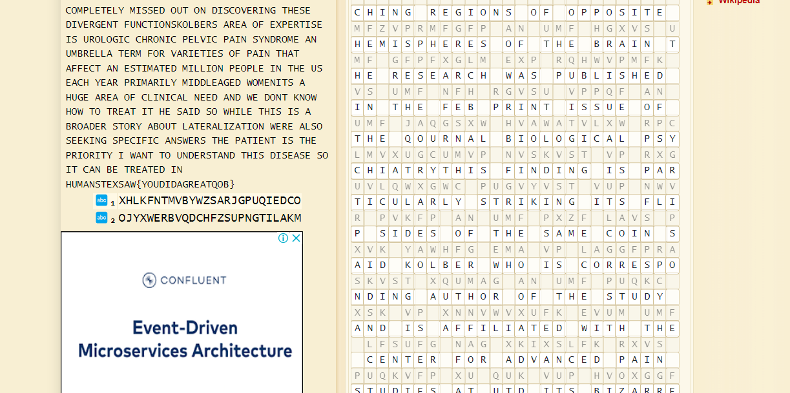

# Ancient Methods
> I have encrypted an article using a substitution cipher. Can you break it and find the key within the article?

## About the Challenge
We were given an encoded message (You can download the file [here](substitution.txt))

## How to Solve?
To solve this chall, im using `Monoalphabetic Substition Decoder` (You can use this [website](https://www.dcode.fr/monoalphabetic-substitution)).



```
TEXSAW{YOUDIDAGREATJOB}
```