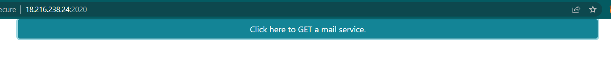
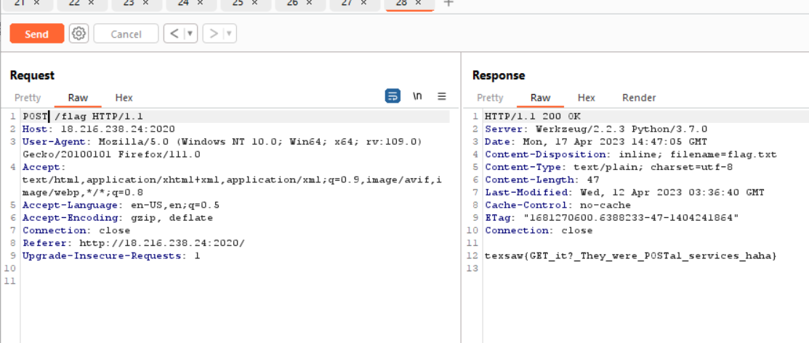

# Mail
> With the holiday season approaching, the demand for package delivery is climbing. I've compiled a list of mail couriers for you to view at url:port. Maybe this could be helpful?

## About the Challenge
We were given a very simple website that contain 1 button. If we press that button we will be redirected to `/flag` endpoint



## How to Solve?
Because I was curious why the button said `Click here to GET a mail service`. In order to obtain the flag, I tried changing the HTTP request method from `GET` to `POST`.



```
texsaw{GET_it?_They_were_POSTal_services_haha}
```