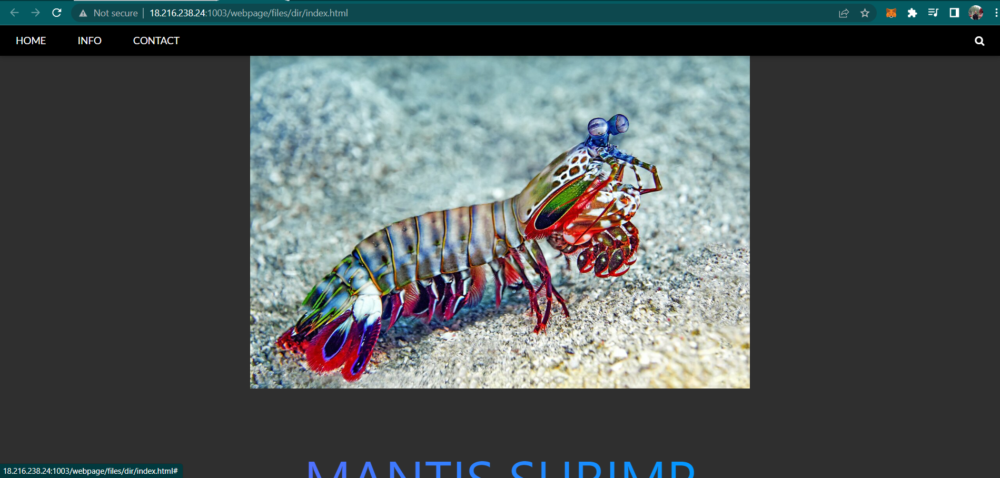

# The Path to Victory
> A elite team of marine biologists have been working to genetically modify mantis shrimp into the ultimate killing machines. Your mission is to exploit vulnerabilities in the enemies website and retrieve session keys (the flag) in order to help bring the organization down.

## About the Challenge
We were given a simple website that contains an information about shrimp



## How to Solve?
If you see the URL in the preview (http://18.216.238.24:1003/webpage/files/dir/index.html) you will notice this website have a lot of directories right? So to find useful information, I tried to access http://18.216.238.24:1003/webpage/


There is a file called `sessions_keys.txt`. Open that file to obtain the flag


```
texsaw{Th3_B3s7_Cru574c34n}
```