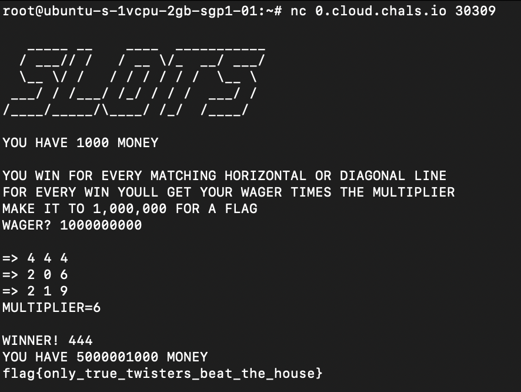

# slots
> I heard about this scam that let people rob some slot machines. Can you do it with this slot machine?

## About the Challenge
We were given a server to connect and also a python code.

```python
#!/usr/bin/env python
import random


def check(f1, f2, f3):
    if f1[0] == f1[1] == f1[2]:
        return True, f1[0] + f1[1] + f1[2]

    if f2[0] == f2[1] == f2[2]:
        return True, f2[0] + f2[1] + f2[2]

    if f3[0] == f3[1] == f3[2]:
        return True, f3[0] + f3[1] + f3[2]

    if f1[0] == f2[1] == f3[2]:
        return True, f1[0] + f2[1] + f3[2]

    if f1[2] == f2[1] == f3[0]:
        return True, f1[2] + f2[1] + f3[0]

    return False, "###"


def rng():
    test = str(random.getrandbits(32))
    test = test.zfill(10)
    return test


def server():
    money = 1000
    print(
        """
   _____ __    ____  ___________
  / ___// /   / __ \/_  __/ ___/
  \__ \/ /   / / / / / /  \__ \\
 ___/ / /___/ /_/ / / /  ___/ /
/____/_____/\____/ /_/  /____/
    """
    )

    print(f"YOU HAVE {money} MONEY")
    print()
    print(f"YOU WIN FOR EVERY MATCHING HORIZONTAL OR DIAGONAL LINE")
    print(f"FOR EVERY WIN YOULL GET YOUR WAGER TIMES THE MULTIPLIER")
    print(f"MAKE IT TO 1,000,000 FOR A FLAG")

    while True:
        try:
            wager = int(input("WAGER? "))
        except:
            wager = 1

        if wager < 0:
            print("SORRY BUD WE'RE NOT A BANK")
            exit()

        money -= wager

        start = rng()

        r1 = start[0:3]
        r2 = start[3:6]
        r3 = start[6:9]
        multi = start[9]

        f1 = r1[2] + r2[2] + r3[2]
        f2 = r1[1] + r2[1] + r3[1]
        f3 = r1[0] + r2[0] + r3[0]

        print()
        print("=>", f1[0], f1[1], f1[2])
        print("=>", f2[0], f2[1], f2[2])
        print("=>", f3[0], f3[1], f3[2])
        print(f"MULTIPLIER={multi}")
        print()

        result, hit = check(f1, f2, f3)

        if result is True:
            print("WINNER!", hit)
            money += wager * int(multi)
        else:
            print("BETTER LUCK NEXT TIME")

        print(f"YOU HAVE {money} MONEY")

        if money <= 0:
            print("SORRY BUD YOU'RE OUT OF CASH")
            exit()
        if money >= 1000000:
            print("FLAG REDACTED")
            exit()


if __name__ == "__main__":
    server()
```

## How to Solve?
I solved this challenge using an unintended way because we could wager more than our balance. Therefore, I tried to wager 100000000 the first time I connected to the server



```
flag{only_true_twisters_beat_the_house}
```