# Tengu In Colosseum
> Now, dear seeker of knowledge, do you yearn for guidance amidst this tangled labyrinth of evidence? Pray, let us illuminate the path before you, clarifying the enigmatic queries that shroud these digital artifacts.

## About the Challenge
We were given an image forensic challenge (on an Android). Additionally, we have received 10 questions that we need to answer correctly in order to obtain the flag.

## How to Solve?
In this case, im using `FTK Imager` to access some of the artifact, and also [SQLite Viewer](https://inloop.github.io/sqlite-viewer/) to parse SQLite artefact

For the first question, we can obtain the information by using `/data/com.Slack/databases/org_T03EA50JASY` and then open the artefact using SQLite viewer.

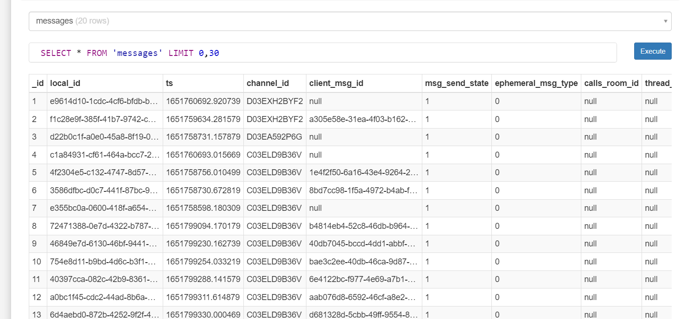

And then find `message_json` column, and read the whole conversation. You can find the group name by checking the data that has id `5` (b34stclub) and also the name of who invited Takumi to join this slack channel is `rosse` (Check data that has id `8`)

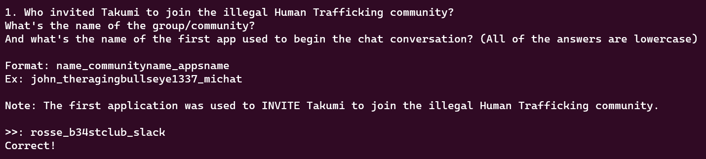

You can find Takumi email by using `/data/com.Slack/databases/T03EA50JASY` artefact and then find `users` table

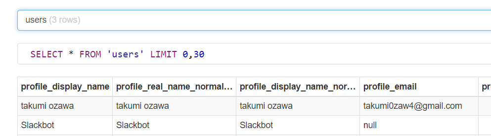

And you can find the name of the boss by using `/data/com.Slack/databases/org_T03EA50JASY` artefact and then find `messages` table and find `message_json` data that has id `3`

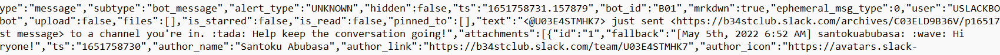

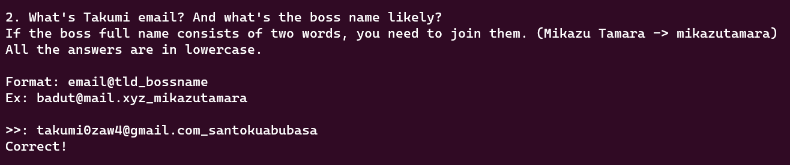

And you can find how many channels are there by using `/data/com.Slack/databases/org_T03EA50JASY` artefact and then find `conversation` table, as you can see there are 6 data in the table. And then find the column called `type`, if the data `type` is PUBLIC, that means that is a slack channel. So, essentially there are only 3 channels in the slack server

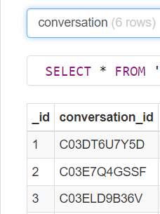

And if you want to find the last created channel, you can sort the `conversation` table based on `latest` column

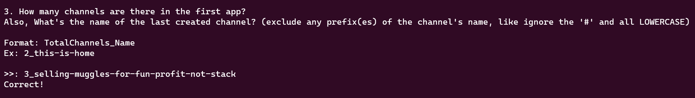

The second app is discord, because if you check the `messages` table again, you will see they plan to moved to discord

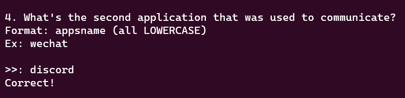

We can obtain the creation date of the discord server by using `/data/com.discord/files/STORE_GUILDS_V34` artefact and then use `string` to check the content of the artefact

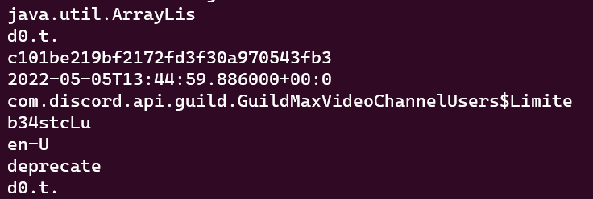

The creation date of the server is `05/05/2022_13:44:59`

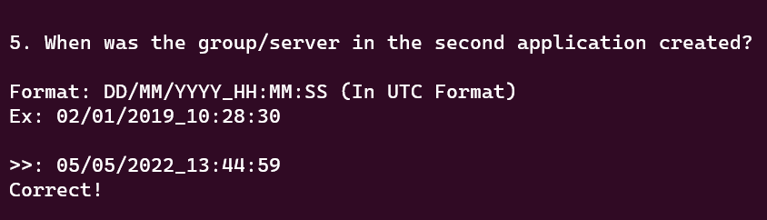

To find who created the registration system, we can check `/data/com.discord/files/STORE_MESSAGES_CACHE_V38`

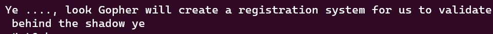

His name is `Gopher`

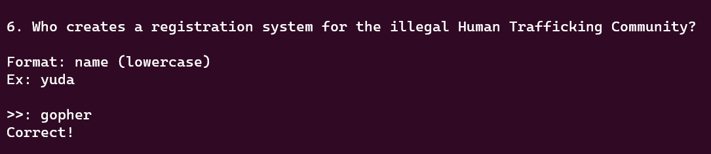

To find the URL, you can use the same artefact, than just find the correct link

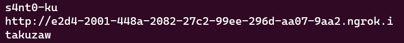

As you can see the the discord name called `s4nt0-kun` give me the link to takumi

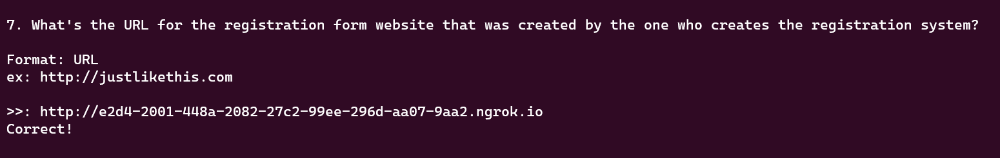

We can see user's trusted domain cache key by accessing `/data/com.discord/shared_prefs/com.discord_preferences.xml` artefact

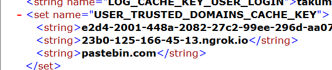

As you can see, the total of `string` element are 3

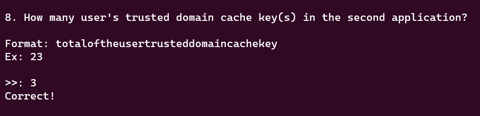

And then for this part, in the discord messages we got a PHP file

```php
<?php
    function generateRandomString($length = 2) {
        $characters = '0123456789abcdefghijklmnopqrstuvwxyzABCDEFGHIJKLMNOPQRSTUVWXYZ';
        $charactersLength = strlen($characters);
        $randomString = '';
        for ($i = 0; $i < $length; $i++) {
            $randomString .= $characters[mt_rand(0, $charactersLength - 1)];
        }
        return $randomString;
    }
    if(isset($_POST['submit'])){
        if($_POST['username'] != ""){
            $username = $_POST['username'];
        }
        if($_POST['password'] != ""){
            $password = $_POST['password'];
        }
        if($_POST['sc'] != ""){
            $sc = $_POST['sc'];
        }
        $enc = openssl_encrypt($password, "rc4", $sc . generateRandomString());
        setcookie('username',$username,time() + (86400 * 30), "/");
        setcookie('guid_usr',$enc, time() + (86400 * 30), "/");
        header("Location: ./success.php");
    }
```

And we need to find the password, luckily one of the team member solved this question by bruteforcing a little bit of character

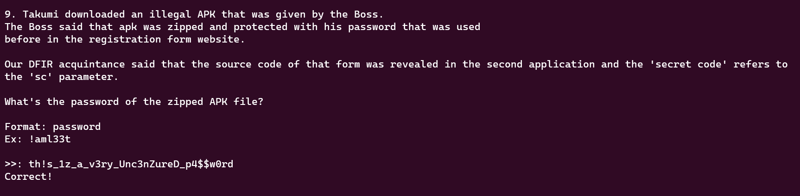

And for this part, you can find the pastebin link in the history, and if you open the pastebin directly, the data has been removed

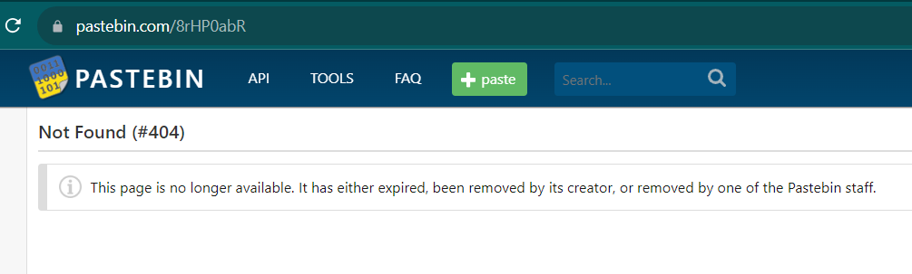

However, you can still see the data using `Wayback Archive`

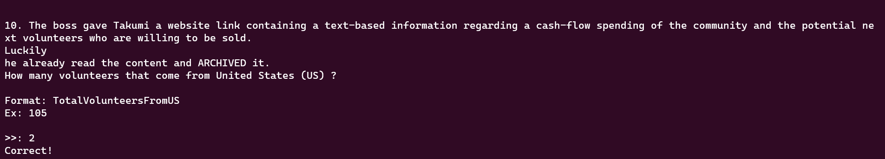

voilà, you obtain the flag

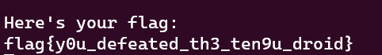

```
flag{y0u_defeated_th3_ten9u_droid}
```