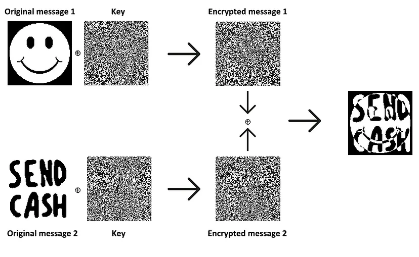
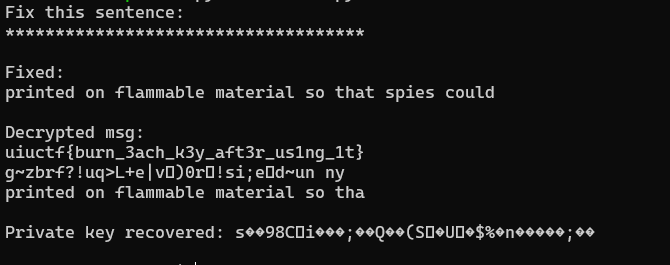

# Three-Time Pad
> We've been monitoring our adversaries' communication channels, but they encrypt their data with XOR one-time pads! However, we hear rumors that they're reusing the pads...

> Enclosed are three encrypted messages. Our mole overheard the plaintext of message 2. Given this information, can you break the enemy's encryption and get the plaintext of the other messages?

## About the Challenge
We got 3 encrypted file and 1 plaintext file. And we need to recover one of the file in order to obtain the flag

## How to Solve?
If you read the description, especially in this part:

```
we hear rumors that they're reusing the pads...
```

In the one-time-pad concept, we cannot use the same key to encrypt the same file. If the same key is used to encrypt, the encrypted file will be readable. Here is how to crack the encrypted file if we reusing the same key


Description: https://crypto.stackexchange.com/questions/59/taking-advantage-of-one-time-pad-key-reuse/108#108

To solve this problem, im using the python program from this [website](http://dann.com.br/alexctf2k17-crypto100-many_time_secrets/)

```python
import string
import collections
import sets, sys

# 3 unknown ciphertexts (in hex format), all encrpyted with the same key
c1 = "06e2f65a4c256d0ba8ada164cecd329cae436069f83476e91757e91bd4a4cce2c60a8f9aac8cb14210d55253cd787c0f6a"
c2 = "14f5f95b4a252948a8aef177d6c92d82e3016362bd7463f41f40a00ad9e0ccad911b959ef8dfad5f1cc4481ecb64"
c3 = "03f9ea574c267249b2b1ef5d91cd3c99904a3f75873871e94157df0fcbb5d1eab94f9386"
ciphers = [c1, c2, c3]
# The target ciphertext we want to crack
target_cipher = "03f9ea574c267249b2b1ef5d91cd3c99904a3f75873871e94157df0fcbb5d1eab94f9386"

# XORs two string
def strxor(a, b):     # xor two strings (trims the longer input)
    return "".join([chr(ord(x) ^ ord(y)) for (x, y) in zip(a, b)])

# To store the final key
final_key = [None]*150
# To store the positions we know are broken
known_key_positions = set()

# For each ciphertext
for current_index, ciphertext in enumerate(ciphers):
        counter = collections.Counter()
        # for each other ciphertext
        for index, ciphertext2 in enumerate(ciphers):
                if current_index != index: # don't xor a ciphertext with itself
                        for indexOfChar, char in enumerate(strxor(ciphertext.decode('hex'), ciphertext2.decode('hex'))): # Xor the two ciphertexts
                                # If a character in the xored result is a alphanumeric character, it means there was probably a space character in one of the plaintexts (we don't know which one)
                                if char in string.printable and char.isalpha(): counter[indexOfChar] += 1 # Increment the counter at this index
        knownSpaceIndexes = []

        # Loop through all positions where a space character was possible in the current_index cipher
        for ind, val in counter.items():
                # If a space was found at least 7 times at this index out of the 9 possible XORS, then the space character was likely from the current_index cipher!
                if val >= 7: knownSpaceIndexes.append(ind)
        #print knownSpaceIndexes # Shows all the positions where we now know the key!

        # Now Xor the current_index with spaces, and at the knownSpaceIndexes positions we get the key back!
        xor_with_spaces = strxor(ciphertext.decode('hex'),' '*150)
        for index in knownSpaceIndexes:
                # Store the key's value at the correct position
                final_key[index] = xor_with_spaces[index].encode('hex')
                # Record that we known the key at this position
                known_key_positions.add(index)

# Construct a hex key from the currently known key, adding in '00' hex chars where we do not know (to make a complete hex string)
final_key_hex = ''.join([val if val is not None else '00' for val in final_key])
# Xor the currently known key with the target cipher
output = strxor(target_cipher.decode('hex'),final_key_hex.decode('hex'))

print "Fix this sentence:"
print ''.join([char if index in known_key_positions else '*' for index, char in enumerate(output)])+"\n"

# WAIT.. MANUAL STEP HERE
# This output are printing a * if that character is not known yet
# fix the missing characters like this: "Let*M**k*ow if *o{*a" = "cure, Let Me know if you a"
# if is too hard, change the target_cipher to another one and try again
# and we have our key to fix the entire text!

#sys.exit(0) #comment and continue if u got a good key

target_plaintext = "printed on flammable material so that spies could"
print "Fixed:"
print target_plaintext+"\n"

key = strxor(target_cipher.decode('hex'),target_plaintext)

print "Decrypted msg:"
for cipher in ciphers:
        print strxor(cipher.decode('hex'),key)

print "\nPrivate key recovered: "+key+"\n"
```

We need to change the ciphertext variable and also the `target_plaintext` variable by using `p2` file. And then run the program using `python2`

```
python2 solve.py
```



```
uiuctf{burn_3ach_k3y_aft3r_us1ng_1t}
```