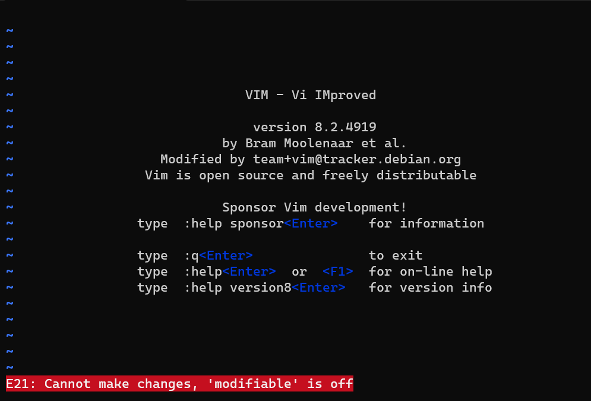
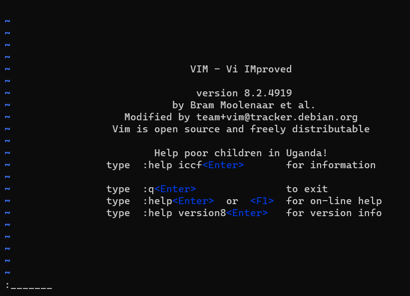
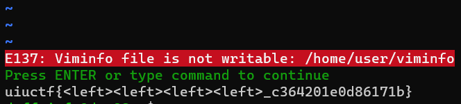

# vimjail2
> Connect with `socat file:$(tty),raw,echo=0 tcp:vimjail2.chal.uiuc.tf:1337`. You may need to install socat.

## About the Challenge
We were given several files related to this chall and I have collected them in 1 zip file (You can download the zip file [here](vimjail2.zip)). In this challenge, we enter `insert mode` in vim, and we have to escape `insert mode` to obtain the flag. If we check the `entry.sh` file

```bash
#!/usr/bin/env sh

vim -R -M -Z -u /home/user/vimrc -i /home/user/viminfo

cat /flag.txt
```

Overall, the command opens Vim in read-only mode with the `modified` option enabled and restricted mode active. It also uses a custom vimrc file located at `/home/user/vimrc` and uses `/home/user/viminfo` as the Viminfo file. And in the end it will print `flag.txt` file. And if we check the `vimrc` file

```
set nocompatible
set insertmode

inoremap <c-o> nope
inoremap <c-l> nope
inoremap <c-z> nope
inoremap <c-\><c-n> nope

cnoremap a _
cnoremap b _
cnoremap c _
cnoremap d _
cnoremap e _
cnoremap f _
cnoremap g _
cnoremap h _
cnoremap i _
cnoremap j _
...
```

I will explain this in each parts:
```
set nocompatible
set insertmode
```

This command will disable compatibility mode and also sets the vim into `insert mode`. And this part:

```
inoremap <c-o> nope
inoremap <c-l> nope
inoremap <c-z> nope
inoremap <c-\><c-n> nope
```

It means whenever we pressed `Ctrl + o`, `Ctrl + l`, `Ctrl + z`, and `Ctrl + \ -> Ctrl + n` insert mode will insert the word `nope`, but because we can't insert any character in `insert mode` this shortcut will be blocked by vim. And the last part:

```
cnoremap a _
cnoremap b _
cnoremap c _
cnoremap d _
cnoremap e _
cnoremap f _
cnoremap g _
cnoremap h _
cnoremap i _
cnoremap j _
...
```

It will convert our input to `_`. For example if i input `:abcde` it will be converted into `:_____`. Here is the preview of the chall when I pressed random character or trying pressed `Ctrl + o`:



## How to Solve?
Well if you read the `vimrc` file again. Especially this part

```
inoremap <c-\><c-n> nope
```

It means we can't pressed `Ctrl + \ -> Ctrl + n` right? It still can be bypassed by pressing `Ctrl + \` twice and then followed by `Ctrl + n`. And now we can input some commands into `vim`



Since we can't input some characters because of the limitation from `vimrc` file, there is 1 alphabet that we can use: `q`. So, how do we obtain the flag easily? Just input the `:q` command. But why can we obtain the flag using the `:q` command? Let's check the `entry.sh` file again.

```bash
#!/usr/bin/env sh

vim -R -M -Z -u /home/user/vimrc -i /home/user/viminfo

cat /flag.txt
```

In the last line of the file, the bash script will print the flag. And `:q` means quit from vim. After quitting vim, that bash file will print the flag for us.



```
uiuctf{<left><left><left><left>_c364201e0d86171b}
```