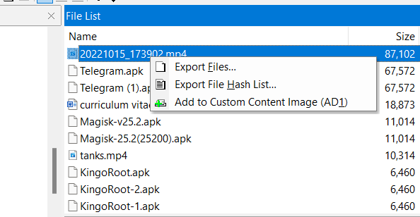
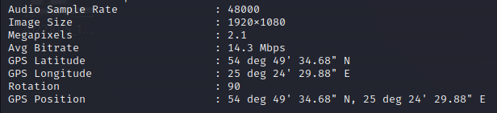

# Based on the analysis of the video file 20221015_173902.mp4, please provide the GPS coordinates of the possible place, where video was recorded
> The main task is to perform the forensic information technology examination on the acquired image of mobile phone. Two suspects (two men) were arrested near Lithuanian and Republic of Belarus border. The truck with stored weapons was taken. During the seizure, a mobile phone without identification tags was founded on the ground near the truck. A criminal case has been opened related to the international illegal arms trade. Please help to find the relevant information for the case, examine the digital dump acquired from the seized phone memory and answer the questions below.

> GPS coordinates. From investigators of the current case, it was determined that the cargo truck recorded in the video file userdata\media\0\Download\20221015_173902.mp4 is the same one that was detained at the time of the crime. Analyze this file and answer the question below.

> Based on the analysis of the video file 20221015_173902.mp4, please provide the GPS coordinates of the possible place, where video was recorded? (please provide the GPS Latitude and Longitude in decimal degrees format (dd.dddd, dd.dddd).

## About the Challenge
We need to find the location of the video

## How to Solve?
First i export the file from FTK Imager (You can find the file on `/userdata/root/media/0/Download` folder)



After that, check the metadata using `exiftool`. There is GPS location in the metadata



```
54.8263, 25.4083
```